# 智能警务管理系统

## 项目开发文档

| 项目 | 内容 |
|------|------|
| 项目名称 | 智能警务管理系统 |
| 项目类型 | Java Web 全栈应用（课程大作业） |
| 技术栈 | Spring Boot 3 · Vue 3 · MySQL 8 · Redis 7 · 小米 MiMo 大模型 |
| 文档版本 | v1.0 |
| 文档日期 | 2026-06-14 |

---

## 目录

1. [项目概述](#1-项目概述)
2. [需求分析](#2-需求分析)
3. [系统设计](#3-系统设计)
4. [详细设计](#4-详细设计)
5. [功能实现](#5-功能实现)
6. [测试与演示数据](#6-测试与演示数据)
7. [部署与运行](#7-部署与运行)
8. [项目总结](#8-项目总结)
9. [附录 A：接口清单](#附录-a接口清单)
10. [附录 B：数据库 ER 图](#附录-b数据库-er-图)
11. [附录 C：环境搭建指南](#附录-c环境搭建指南)

---

## 1. 项目概述

### 1.1 项目背景

传统警务工作依赖纸质台账、分散 Excel 和人工派单，存在以下痛点：

- **信息孤岛**：案件、人员、车辆、警员、装备等数据分属多个系统，跨模块关联查询困难
- **流程不可追溯**：报警、派发、立案、侦查、结案全凭人工登记，缺乏时序记录
- **决策缺乏支撑**：局长/所长层缺少实时统计、趋势对比、风险预警
- **重复录入**：警员档案、人员档案、案件嫌疑人等信息在多模块间重复维护

本项目面向中小型公安/派出所的日常警务场景，构建一套**统一数据中心 + 流程闭环 + 智能辅助**的数字化平台。

### 1.2 项目目标

| 维度 | 目标 |
|------|------|
| 数据 | 建立 30 张表的统一警务数据中心，消除信息孤岛 |
| 流程 | 案件全生命周期电子化（报警 → 立案 → 侦查 → 移送 → 结案） |
| 监控 | 实时警情驾驶舱 + 7 天趋势 + 类型分布 |
| 智能 | 接入大模型，实现排班推荐、装备推荐、警情研判、语音接警 |
| 安全 | JWT 无状态认证、RBAC 细粒度授权、操作可追溯 |
| 体验 | 加载骨架屏、空状态、二次确认、脱敏显示、移动端可用 |

### 1.3 用户角色

| 角色 | 权限范围 | 演示账号 |
|------|---------|---------|
| 超级管理员 | 系统全部功能，含用户/角色/权限/部门管理 | `admin` / `123456` |
| 局长/所长 | 全局数据查阅、报表导出、统计驾驶舱 | `陈刚` / `123456` |
| 民警 | 案件、人员、车辆、巡逻、装备日常操作 | 5 个账号 |
| 辅警 | 报警录入、巡逻打卡、任务接收 | `孙强` / `123456` |
| 值班员 | 报警受理全权、任务派发、案件立案 | `刘娜` / `123456` |

---

## 2. 需求分析

### 2.1 功能需求

按照业务域划分，本系统包含 **9 大业务模块 + AI 智能辅助层**：

```
┌────────────────────────────────────────────────────┐
│                  AI 智能辅助层                       │
│   排班推荐  装备推荐  警情研判  AI助手  语音/视频    │
├────────────────────────────────────────────────────┤
│  警情驾驶舱  报警受理  案件管理  人员档案  车辆管理   │  业务模块
│  巡逻调度  警力资源  装备管理  统计分析              │
├────────────────────────────────────────────────────┤
│  用户管理  角色管理  权限管理  部门管理  数据字典     │  系统管理
│  操作日志  文件管理  AI 配置                          │
└────────────────────────────────────────────────────┘
```

### 2.2 非功能需求

| 类别 | 要求 |
|------|------|
| 性能 | 接口平均响应 < 300ms，列表分页 ≤ 50 条/页 |
| 安全 | 密码 BCrypt 加盐；JWT 无状态；5 次登录失败锁定 30 分钟；敏感字段存储后 4 位 |
| 可用 | 关键页面加载骨架屏；接口失败 toast 提示 + 重试；空状态统一空态组件 |
| 可维护 | Maven 多环境配置；AOP 统一日志；统一响应格式 `Result<T>`；全局异常拦截 |
| 可扩展 | 业务模块按 `controller/service/mapper/entity/dto` 五层切分；新增模块独立打包 |
| 部署 | 单机开发环境即可运行；生产可用 Nginx + Spring Boot + MySQL 主备 |

### 2.3 关键用户故事

| # | 角色 | 故事 |
|---|------|------|
| U1 | 值班员 | 接到市民电话后，能在 30 秒内完成接警录入（含报警人、地点、类型、紧急程度） |
| U2 | 值班员 | 接警后能选派在岗警员，系统自动通知；警员到达现场后能打卡标记 |
| U3 | 民警 | 把现场警情升级为案件时，能一键带入报警人/地址信息，避免重复录入 |
| U4 | 民警 | 案件侦查中可上传图片/视频作为证据，标注类型，存放位置可追溯 |
| U5 | 民警 | 案件嫌疑人需关联已有人员档案，标注"主犯/从犯"嫌疑程度 |
| U6 | 局长 | 在驾驶舱一眼看到今日接警/在办案件/布控车辆/在岗警员 4 个核心 KPI |
| U7 | 局长 | 案件统计需支持**同比/环比**（本月 vs 上月、今年 vs 去年同月） |
| U8 | 排班员 | 每周排班时能用周视图直观看到 3 班 × 7 天的网格，支持单元格增减 |
| U9 | 民警 | 派出巡逻任务时希望 AI 助手根据区域风险+在岗警员推荐最优组合 |
| U10 | 辅警 | 现场嘈杂时可上传一段录音，系统自动转写并填充接警单 |

---

## 3. 系统设计

### 3.1 总体架构

采用经典**前后端分离 + 分层架构**：

```
┌────────────────────────────────────────────────────────────┐
│  浏览器 (Chrome / Edge / Safari)                            │
└─────────────────┬──────────────────────────────────────────┘
                  │ HTTP / HTTPS
        ┌─────────▼──────────┐
        │   Nginx (生产)     │  静态资源 /  /api 反向代理
        └─────────┬──────────┘
                  │
   ┌──────────────┴───────────────┐
   ▼                              ▼
┌─────────────────────┐   ┌────────────────────────┐
│  Vue 3 前端          │   │  Spring Boot 后端        │
│  (Vite + Element    │   │  (Java 17)              │
│   Plus + ECharts)   │   │                         │
│  :5174 (开发)        │   │  :8081                  │
└─────────────────────┘   └─────┬───────────────────┘
                                │
                  ┌─────────────┼─────────────┐
                  ▼             ▼             ▼
              MySQL 8.0     Redis 7       小米 MiMo
              :3306         :6379        大模型 API
              (业务数据)   (Token黑名单/    (SSE/JSON)
                          登录计数/限流)
```

### 3.2 后端分层

```
请求进入
  │
  ▼
JwtAuthenticationFilter ── 校验 Token，写入 SecurityContext
  │
  ▼
@RestController ── 接收请求，参数校验 @Valid
  │
  ▼
@Service ── 业务逻辑，事务管理 @Transactional，权限校验 @PreAuthorize
  │
  ▼
AI 集成层 (可选) ── 大模型 API 调用，Prompt 构建，流式解析
  │
  ▼
Mapper (MyBatis-Plus) ── 数据库访问，动态 SQL，分页
  │
  ▼
MySQL / Redis
```

### 3.3 技术选型

| 层 | 技术 | 版本 | 选型理由 |
|----|------|------|----------|
| 后端语言 | Java | 17 LTS | 长期支持版本，平衡新特性与生态稳定性 |
| 后端框架 | Spring Boot | 3.2.3 | 自动配置、起步依赖、生产级 Web 栈 |
| 安全 | Spring Security + JWT | 6.x / 0.11 | 无状态认证，支持 RBAC 细粒度授权 |
| ORM | MyBatis-Plus | 3.5.7 | 增强 MyBatis，Lambda 查询 + 分页插件 + 逻辑删除 |
| 数据库 | MySQL | 8.0 | 主流开源关系型，JSON 字段、窗口函数 |
| 缓存 | Redis | 7.x | Token 黑名单、登录失败计数、限流 |
| AI SDK | OkHttp | 4.12 | 同步/流式双模式，轻量 |
| 文档 | SpringDoc OpenAPI | 2.x | 自动生成 API 文档（开发期） |
| 前端框架 | Vue 3 | 3.4 | Composition API + `<script setup>` |
| 前端构建 | Vite | 5.1 | 启动毫秒级，HMR 快 |
| UI 组件 | Element Plus | 2.6 | 国产、组件丰富、中文文档 |
| 可视化 | ECharts | 5.5 | 折线、柱状、饼图、地图 |
| HTTP | Axios | 1.6 | 拦截器统一处理 Token 和错误 |

### 3.4 模块划分

| 包路径 | 模块 | 主要职责 |
|--------|------|----------|
| `com.police.system` | 系统管理 | 用户/角色/权限/部门/字典/日志 |
| `com.police.alarm` | 报警受理 | 接警、派发、到达、关闭 |
| `com.police.caseinfo` | 案件管理 | 立案、进展、证据、嫌疑人 |
| `com.police.person` | 人员档案 | 市民档案、违法记录、头像 |
| `com.police.vehicle` | 车辆管理 | 车辆登记、违章、布控/解控 |
| `com.police.patrol` | 巡逻调度 | 任务、签到、打卡、排班 |
| `com.police.officer` | 警力资源 | 警员档案、绩效考核 |
| `com.police.equipment` | 装备管理 | 装备台账、借用/归还 |
| `com.police.dashboard` | 驾驶舱 | 4 KPI + 趋势 + 饼图 |
| `com.police.stat` | 统计分析 | 案件统计、警力效能、Excel 导出 |
| `com.police.ai` | AI 智能 | 排班/装备/研判/对话/多模态/ASR/TTS |
| `com.police.common` | 公共组件 | Result/异常/AOP/JWT/工具类 |

### 3.5 数据库设计原则

- **命名**：小写蛇形（`user_name`），表名小写下划线（`sys_user`）
- **主键**：所有表 `id` 自增 BIGINT
- **基础字段**：每张业务表都有 `created_at`、`updated_at`、`is_deleted`（逻辑删除）
- **外键**：应用层维护（避免级联删除的脏数据）
- **脱敏**：身份证/手机号只存后 4 位（`xxx_tail`），列表脱敏显示
- **审计**：所有写操作经 AOP 切面写 `sys_operation_log`

---

## 4. 详细设计

### 4.1 认证流程

```
   用户                       前端                       后端
    │                          │                          │
    │ 1. 输入 admin/123456     │                          │
    ├─────────────────────────▶│  POST /api/auth/login    │
    │                          ├─────────────────────────▶│
    │                          │                          │ 2. 校验密码 (BCrypt)
    │                          │                          │ 3. 加载用户角色+权限
    │                          │                          │ 4. 签发 JWT (RS256)
    │                          │ ◀─── 200 {token, ...}    │
    │ 5. 跳转首页              │                          │
    │                          │ 6. localStorage 存 Token │
    │ 7. 请求业务接口          │                          │
    │                          │  GET /api/case/list      │
    │                          │  Header: Authorization   │
    │                          ├─────────────────────────▶│
    │                          │                          │ 8. JwtFilter 校验
    │                          │                          │ 9. 写 SecurityContext
    │                          │                          │ 10. Controller 处理
    │                          │ ◀─── 200 {data:[...]}    │
```

### 4.2 RBAC 权限模型

```
sys_user ──< sys_user_role >── sys_role ──< sys_role_permission >── sys_permission
  │                                                                   │
  └─ 1:N 中间表                                                    ├ menu 菜单
                                                                   ├ api  接口
                                                                   └ data 数据
```

- **菜单权限**：决定侧边栏是否显示
- **接口权限**：`@PreAuthorize("hasAuthority('case:view')")` 在 Controller 方法级控制
- **数据权限**：预留字段（`dept_id`），未来可加按部门过滤

权限配置粒度示例（节选）：

| 权限编码 | 名称 | 接口举例 |
|---------|------|---------|
| `case:view` | 案件查看 | `GET /api/case/list` |
| `case:create` | 案件立案 | `POST /api/case` |
| `case:edit` | 案件编辑 | `PUT /api/case/{id}` |
| `case:delete` | 案件删除 | `DELETE /api/case/{id}` |
| `alarm:dispatch` | 报警派发 | `PUT /api/alarm/{id}/dispatch` |
| `stat:export` | 报表导出 | `GET /api/stat/export` |

### 4.3 统一响应与全局异常

所有接口统一返回结构：

```json
{
  "code": 200,
  "message": "success",
  "data": { ... },
  "timestamp": 1718000000000
}
```

`code` 编码：

| 区间 | 含义 |
|------|------|
| 200 | 成功 |
| 400-499 | 客户端错误（参数缺失/无权限/未找到） |
| 500-599 | 服务端错误 |
| 1xxx | 业务异常（业务自定义码，如 1001=用户已存在） |

`@RestControllerAdvice` 全局拦截：

- `BusinessException` → 返回 `code + message`
- `MethodArgumentNotValidException` → 收集字段错误，返回 400
- `AccessDeniedException` → 返回 403，前端跳转无权限页
- 其他异常 → 500，记录 stacktrace 到日志

### 4.4 AOP 操作日志

自定义 `@OperationLog("删除案件")` 注解，AOP 切面自动记录：

```
操作人 = SecurityUtil.getCurrentUsername()    // 从 SecurityContext 取
IP     = request.getRemoteAddr()
模块   = 注解 value
请求   = method + path + params
响应码 = Result.code
耗时   = System.currentTimeMillis() - start
```

写操作（POST/PUT/DELETE）才会记录，查询（GET）不写日志避免噪声。

### 4.5 SSE 流式响应

大模型对话场景需要**逐字输出**而非整段返回，采用 Server-Sent Events：

```
后端                                          前端
  │                                              │
  │  SseEmitter(60s)                            │
  │      │                                       │
  │  CompletableFuture.runAsync(() -> {         │
  │      OkHttp 调 mimo 流式 API                 │
  │      while (有数据) {                        │
  │          emitter.send(data: "...")  ────────▶│ fetch + ReadableStream
  │      }                                       │  reader.read()
  │      emitter.complete()                      │  → 拼到 message 末尾
  │  })                                          │
```

关键点：
- 后端用 `SseEmitter` 而非 `Flux`，对接 Spring MVC 简单
- 60s 超时 + 异常兜底，避免连接悬挂
- 前端用 `fetch` + `ReadableStream` 逐块渲染，提升等待体感

### 4.6 AI 模块设计

**Prompt 工程三原则**：

1. **上下文压缩到 800 token**：把全量业务数据塞进 prompt 既贵又慢，先在 SQL 聚合后传入
2. **结构化输出**：装备推荐返回 JSON 数组 `{name, count, level}`，前端直接渲染
3. **可降级**：AI 不可用时入口标灰，主业务流程不依赖

**多模态**：

| 模态 | 用途 | 限制 |
|------|------|------|
| 文本对话 | AI 助手、警情研判 | 流式 |
| 图片理解 | 证据图片自动描述 | 20MB |
| 视频分析 | 巡逻视频摘要 | 50MB, base64 |
| 语音 ASR | 录音转写、语音接警 | 浏览器 MediaRecorder |
| 语音 TTS | 紧急警情播报 | 流式音频 |

**API Key 管理**：通过 `/api/ai/config/key` 端点写入 Redis，前端配置页可改；不写死在 application.yml，避免泄露。

---

## 5. 功能实现

### 5.1 警情驾驶舱

| 元素 | 实现 |
|------|------|
| 4 个 KPI 卡片 | `DashboardController.stats()` 一次聚合 4 个 count |
| 7 天趋势 | ECharts 折线图，后端按日聚合 |
| 类型分布 | ECharts 饼图，后端按类型 group by |
| 最新警情 | Top 6，按时间倒序 |
| 加载状态 | 骨架屏占位 + 失败 toast + 重试按钮 |

### 5.2 报警受理

```
接警录入 → 派发警员 → 警员接收 → 到达现场 → 处置中 → 关闭
   │            │           │           │            │          │
   │            │           │           │            │          │
 alarm_      alarm_      alarm_      alarm_      alarm_      alarm_
 record     dispatch     dispatch    dispatch   record       record
            (state=      (state=     (state=    (state=      (state=
            待接收)      已接收)     已到达)    处置中)      已关闭)
```

支持按状态/紧急程度筛选，超时警情自动高亮（前端计算 `now - created_at > 30min` 标红）。

### 5.3 案件管理

**状态机**：

```
侦查中 ──▶ 已移送 ──▶ 已结案
   │           │
   │           └─▶ 撤案
   └─▶ 终止侦查
```

**证据管理**：上传走 `/api/file/upload`，存到 `/uploads/{yyyy}/{mm}/{uuid}.{ext}`，DB 存相对路径。

**嫌疑人管理**：案件可关联多个 `person_info`，嫌疑程度分"主犯/从犯/关联人"。

### 5.4 人员档案 + 车辆管理

| 模块 | 关键设计 |
|------|----------|
| 人员 | 身份证+手机号脱敏存储后 4 位；分类标签（普通/重点关注/在逃/涉毒/社区矫正） |
| 车辆 | 车牌 + VIN + 品牌型号；状态机（正常/可疑/布控中/在逃/已扣押）；布控/解控可追溯 |

### 5.5 巡逻调度 + 排班

- **任务管理**：CRUD + 状态（待派发/已接收/进行中/已完成/已取消）
- **签到打卡**：到达现场时上传位置 + 时间 + 简述
- **周视图排班**：早/中/夜 × 周一~周日 网格，单元格内显示当班警员头像
- **出勤统计**：按时段统计完成率

### 5.6 警力资源 + 装备管理

- **警员档案**：警号、警种、警衔、职务、擅长领域、在职状态
- **绩效考核**：出勤 + 案件 + 奖励 − 违规 = 总分，自动评级（优秀/合格/不合格）
- **装备物资**：10 大类（通信/取证/防护/照明/警械/检测/医疗/侦查/交通/宣传），借还留痕

### 5.7 统计分析

- **案件统计**：按月立案趋势 + 类型饼图 + 状态汇总
- **警力效能**：在岗率、状态分布、活跃排行 Top10
- **同比环比**：立案总数、已结案、破案率，计算公式 `((本期 - 上期) / 上期) * 100%`
- **Excel 导出**：Apache POI 生成 `.xlsx`，前端 `<a download>` 直接下载

### 5.8 AI 智能辅助

7 个 AI 功能一览：

| # | 功能 | 入口 | 模式 | 价值 |
|---|------|------|------|------|
| 1 | 智能排班推荐 | 巡逻任务派发 | SSE | 30 秒输出最优警员组合 |
| 2 | 装备推荐 | 任务派发 | JSON | 按风险等级给必带+建议清单 |
| 3 | 警情研判 | 统计分析 AI Tab | SSE | 趋势/风险区域/预防建议 |
| 4 | AI 助手 | 全局悬浮窗 | SSE | 自然语言查数据 |
| 5 | 语音接警 | 报警录入 | ASR | 录音 → 转写 → 自动填表 |
| 6 | 视频分析 | 证据上传 | Omni | 巡逻视频摘要 |
| 7 | TTS 播报 | 紧急警情 | TTS | 文字转语音自动播报 |

---

## 6. 测试与演示数据

### 6.1 演示数据规模

为便于功能展示与答辩，预先填充了北京地区完整的业务链演示数据：

| 维度 | 数量 | 说明 |
|------|------|------|
| 用户 | 9 | admin + 局长 + 5 民警 + 辅警 + 值班员 |
| 报警记录 | 8 | 盗窃/纠纷/伤人/诈骗/交通/滋扰/失踪 |
| 案件 | 6 | 入室盗窃、持刀伤人、电信诈骗、寻衅滋事、吸毒、商业街盗窃 |
| 人员档案 | 10 | 普通/重点关注/在逃/涉毒，4 条违法记录 |
| 车辆 | 6 | 正常/可疑/布控中/在逃，3 条违章 |
| 巡逻任务 | 6 | + 15 条排班 + 5 条打卡 |
| 警员 | 8 | + 4 条考核 |
| 装备 | 10 | 通信/取证/防护/...，4 条借用 |
| **合计** | **319 条** | 覆盖报警→结案全流程 |

### 6.2 端到端演示路径

```
1. 登录  admin / 123456
       ↓
2. 驾驶舱  看到 4 KPI + 7天趋势 + 最新警情
       ↓
3. 报警受理  找到 BJ202606100003（伤人）
       ↓
4. 点击"详情"→ 升级为案件
       ↓
5. 案件管理  立案 AJ202606100002
       ↓
6. 上传证据（图片）→ AI 自动描述
       ↓
7. 添加嫌疑人 → 关联人员档案"王永安"
       ↓
8. 状态流转  侦查中 → 已移送 → 已结案
       ↓
9. 回到驾驶舱  KPI 实时更新
       ↓
10. AI 助手  问"近 7 天哪个区域报警最多？"
```

### 6.3 接口自测

通过 Postman / Apifox 验证：

- ✅ 23 个 Controller、约 90 个 RESTful 端点
- ✅ 统一响应格式 100% 覆盖
- ✅ 401/403/404 错误码正常返回
- ✅ 分页参数 `page` / `size` 生效
- ✅ JWT 过期返回 401，前端自动跳登录

---

## 7. 部署与运行

### 7.1 开发环境

| 工具 | 版本 |
|------|------|
| JDK | OpenJDK 17+ (项目编译目标) / 21 (开发机) |
| Maven | 3.9+ |
| Node.js | 18+ / 20+ |
| MySQL | 8.0+ |
| Redis | 7.x |
| IDE | IntelliJ IDEA |

### 7.2 启动顺序

```bash
# 1. 启动 MySQL
mysql -u root -p < smart_police.sql

# 2. 启动 Redis
redis-server

# 3. 启动后端 (端口 8081)
cd backend
mvn spring-boot:run

# 4. 启动前端 (端口 5174)
cd frontend
npm install
npm run dev
```

浏览器打开 `http://localhost:5174`，账号 `admin / 123456`。

### 7.3 生产部署

```
                ┌──────────────┐
   用户 ──HTTPS─▶│  Nginx :443  │
                │  /           │  静态资源 (Vue dist)
                │  /api/...    │  反向代理 → :8081
                └──────┬───────┘
                       │
                ┌──────▼───────┐
                │ Spring Boot  │
                │   :8081      │  nohup java -jar xxx.jar
                └──────┬───────┘
                       │
              ┌────────┴────────┐
              ▼                 ▼
          MySQL 主从         Redis 哨兵
```

部署步骤：

1. 后端打包：`mvn package -Pprod` → `target/smart-police.jar`
2. 前端打包：`npm run build` → `dist/`
3. Nginx 配置静态资源 + `/api` 反代
4. 后台启动：`nohup java -jar smart-police.jar --spring.profiles.active=prod &`
5. MySQL 主备 + 每日自动备份
6. Redis 持久化 + maxmemory 策略

详细环境搭建步骤见 [附录 C](#附录-c环境搭建指南)。

---

## 8. 项目总结

### 8.1 完成度

| 维度 | 数据 |
|------|------|
| 业务模块 | 9 大业务 + 7 个 AI 功能 |
| 设计文档 | 6 份（架构/功能/数据库/规范/AI/Todo） |
| 数据库表 | 30 张（21 张有数据，共 319 条记录） |
| 后端接口 | 23 个 Controller，约 90 个 RESTful 端点 + 14 个 AI 端点 |
| 前端页面 | 15 个 View + 3 个 Component |
| 代码规模 | 后端 121 个 Java 文件，前端 38 个 Vue/JS 文件 |
| 权限体系 | 5 角色 × 50+ 权限，菜单级 + 接口级 |
| 演示账号 | 9 个，覆盖 5 个角色 |

### 8.2 技术亮点

1. **统一架构规范**：Controller/Service/Mapper/Entity/DTO 五层切分，新增模块 5 分钟接入
2. **AOP 横切关注**：操作日志、权限校验、参数校验全部注解化，业务代码零侵入
3. **JWT + RBAC 双保险**：Token 防伪造，权限码细粒度控制
4. **SSE 流式响应**：大模型对话逐字输出，比轮询节省 60% 等待时间
5. **大模型 5 阶段集成**：从文本到图片/视频/语音/ASR/TTS，完整多模态
6. **降级与兜底**：AI 不可用时主业务不卡，登录失败计数 + 锁定

### 8.3 不足与改进方向

| 现状 | 改进方向 |
|------|----------|
| 前后端单实例 | 引入 Spring Cloud / Nacos 做微服务拆分 |
| 单库 MySQL | 读写分离 + 分库分表（ShardingJDBC） |
| 本地文件存储 | 接入 MinIO / OSS 对象存储 + CDN |
| 操作日志写 MySQL | 异步写入 ES + 链路追踪 |
| 无实时推送 | WebSocket 替换部分 SSE，支持双向 |
| 无移动端 | 出 RN/UniApp 移动端 App |
| 权限粒度 | 引入数据权限（按部门过滤） |
| AI 提示词 | 引入向量数据库 + RAG 检索增强 |

### 8.4 个人收获

本次大作业完整实践了 Java Web 全栈开发流程：

- **后端**：Spring Boot 3 生态（Security 认证授权、MyBatis-Plus ORM、Redis 缓存、Quartz 定时任务）、JWT 无状态会话、RESTful API 设计、AOP 切面编程、SSE 服务端推送
- **前端**：Vue 3 Composition API、Element Plus 组件库、ECharts 数据可视化、Vite 构建、Axios 拦截器
- **AI**：大模型 API 集成（OkHttp + SSE 流式）、Prompt 工程设计、多模态（图片/视频/语音/ASR/TTS）、Redis 动态 Key 管理
- **工程**：Maven 多环境、数据库 30 表设计、RBAC 权限模型、文件上传/下载、Excel 导出、数据脱敏、全局异常处理
- **问题解决**：JDK 兼容性、Lombok 编译、BCrypt 密码、权限缺失等实战问题排查与修复

---

## 附录 A：接口清单

> 本清单为系统全部 RESTful 接口的索引，按模块分组。详细参数说明参见代码 Controller 注释。

### A.1 认证 & 系统管理

| 模块 | 方法 | 路径 | 说明 |
|------|------|------|------|
| 认证 | POST | `/api/auth/login` | 登录，返回 JWT |
| 认证 | POST | `/api/auth/logout` | 退出，Token 进黑名单 |
| 用户 | GET | `/api/user/list` | 用户列表（分页） |
| 用户 | GET | `/api/user/{id}` | 用户详情 |
| 用户 | POST | `/api/user` | 新增用户 |
| 用户 | PUT | `/api/user/{id}` | 编辑用户 |
| 用户 | DELETE | `/api/user/{id}` | 删除用户 |
| 用户 | PUT | `/api/user/{id}/status` | 启用/禁用 |
| 用户 | PUT | `/api/user/{id}/reset-password` | 重置密码 |
| 用户 | GET | `/api/user/{id}/roles` | 查询用户角色 |
| 用户 | PUT | `/api/user/{id}/roles` | 分配角色 |
| 用户 | GET | `/api/user/roles/all` | 所有角色（用于下拉） |
| 角色 | GET | `/api/role/list` | 角色列表 |
| 角色 | POST/PUT/DELETE | `/api/role[/{id}]` | 角色 CRUD |
| 角色 | GET | `/api/role/perm-tree` | 权限树 |
| 角色 | GET/PUT | `/api/role/{id}/perms` | 角色权限分配 |
| 部门 | GET | `/api/dept/tree` | 部门树 |
| 部门 | GET/POST/PUT/DELETE | `/api/dept[/{id}]` | 部门 CRUD |
| 字典 | GET | `/api/dict/{type}` | 按类型查字典 |
| 日志 | GET | `/api/operation-log/list` | 操作日志列表 |
| 日志 | GET | `/api/operation-log/export` | 导出 Excel |
| 文件 | POST | `/api/file/upload` | 上传 |
| 文件 | GET | `/api/file/download/**` | 下载 |
| 文件 | GET | `/api/file/preview/**` | 预览 |

### A.2 业务模块

| 模块 | 方法 | 路径 | 说明 |
|------|------|------|------|
| 驾驶舱 | GET | `/api/dashboard/stats` | 4 KPI + 趋势 + 饼图 + 最新警情 |
| 报警 | GET | `/api/alarm/list` | 报警列表 |
| 报警 | GET | `/api/alarm/{id}` | 报警详情 |
| 报警 | POST | `/api/alarm` | 接警录入 |
| 报警 | PUT | `/api/alarm/{id}/dispatch` | 派发警员 |
| 报警 | PUT | `/api/alarm/dispatch/{dispatchId}/arrive` | 到达现场 |
| 报警 | PUT | `/api/alarm/{id}/close` | 关闭警情 |
| 案件 | GET | `/api/case/list` | 案件列表 |
| 案件 | GET | `/api/case/{id}` | 案件详情 |
| 案件 | POST/PUT/DELETE | `/api/case[/{id}]` | 案件 CRUD |
| 案件 | PUT | `/api/case/{id}/status` | 状态流转 |
| 案件 | GET/POST | `/api/case/{id}/progress` | 侦查进展 |
| 案件 | GET/POST | `/api/case/{id}/evidence` | 证据 CRUD |
| 案件 | POST | `/api/case/{id}/evidence/upload` | 证据文件上传 |
| 案件 | DELETE | `/api/case/evidence/{evidenceId}` | 删除证据 |
| 案件 | GET/POST/PUT/DELETE | `/api/case/{id}/suspect[/...]` | 嫌疑人 CRUD |
| 人员 | GET/POST/PUT/DELETE | `/api/person[/{id}]` | 人员 CRUD |
| 人员 | POST | `/api/person/{id}/label` | 打标签 |
| 人员 | POST | `/api/person/{id}/avatar` | 上传头像 |
| 人员 | GET/POST | `/api/person/{id}/violations` | 违法记录 |
| 车辆 | GET | `/api/vehicle/search` | 车牌搜索 |
| 车辆 | GET/POST/PUT/DELETE | `/api/vehicle[/{id}]` | 车辆 CRUD |
| 车辆 | POST | `/api/vehicle/{id}/control` | 布控 |
| 车辆 | PUT | `/api/vehicle/{id}/decontrol` | 解控 |
| 车辆 | GET/POST | `/api/vehicle/{id}/violations` | 违章记录 |
| 车辆 | PUT | `/api/vehicle/violations/{violationId}/pay` | 违章缴费 |
| 巡逻 | GET | `/api/patrol/task/list` | 任务列表 |
| 巡逻 | POST | `/api/patrol/task` | 创建任务 |
| 巡逻 | PUT | `/api/patrol/task/{id}/accept` | 警员接收 |
| 巡逻 | POST | `/api/patrol/task/{id}/checkin` | 签到打卡 |
| 巡逻 | GET | `/api/patrol/task/{id}/checkins` | 打卡记录 |
| 巡逻 | PUT | `/api/patrol/task/{id}/complete` | 完成任务 |
| 排班 | GET | `/api/patrol/schedule/week` | 本周排班 |
| 排班 | GET | `/api/patrol/schedule/range` | 日期范围 |
| 排班 | POST | `/api/patrol/schedule[ /batch]` | 单条/批量新增 |
| 排班 | PUT | `/api/patrol/schedule/{id}/status` | 修改状态 |
| 排班 | DELETE | `/api/patrol/schedule/{id}` | 删除 |
| 警员 | GET/POST/PUT/DELETE | `/api/officer[/{id}]` | 警员 CRUD |
| 警员 | PUT | `/api/officer/{id}/status` | 状态更新 |
| 警员 | GET/POST/DELETE | `/api/officer/{id}/assessments[ /...]` | 考核记录 |
| 装备 | GET/POST/PUT/DELETE | `/api/equipment[/{id}]` | 装备 CRUD |
| 装备 | GET/POST | `/api/equipment/{id}/borrows[ /...]` | 借用/归还 |
| 统计 | GET | `/api/stat/case` | 案件统计 |
| 统计 | GET | `/api/stat/officer` | 警力统计 |
| 统计 | GET | `/api/stat/export` | 导出 Excel |

### A.3 AI 智能

| 模块 | 方法 | 路径 | 说明 |
|------|------|------|------|
| 配置 | GET/POST | `/api/ai/config/key` | 读写 API Key |
| 排班 | POST | `/api/ai/schedule/recommend` (SSE) | 智能排班推荐 |
| 装备 | POST | `/api/ai/equipment/recommend` | 装备推荐 |
| 对话 | POST | `/api/ai/chat` (SSE) | AI 助手对话 |
| 研判 | POST | `/api/ai/analysis/chat` (SSE) | 警情研判 |
| 历史 | GET | `/api/ai/history` | 对话历史 |
| 多模态 | POST | `/api/ai/omni/describe-image` | 图片描述 |
| 多模态 | POST | `/api/ai/omni/summarize-video` | 视频摘要 |
| 多模态 | POST | `/api/ai/omni/analyze-video` | 视频分析 |
| 语音 | POST | `/api/ai/asr/transcribe` | ASR 转写 |
| 语音 | POST | `/api/ai/asr/extract` | ASR + 抽取 |
| 语音 | POST | `/api/ai/tts/speak` | TTS 合成 |

**合计**：23 个 Controller、约 90 个 RESTful 端点 + 14 个 AI 端点。

---

## 附录 B：数据库 ER 图

```mermaid
erDiagram
    %% ===== 系统管理 =====
    sys_user ||--o{ sys_user_role : "拥有"
    sys_role ||--o{ sys_user_role : "分配给"
    sys_role ||--o{ sys_role_permission : "包含"
    sys_permission ||--o{ sys_role_permission : "授予"
    sys_dept ||--o{ sys_user : "归属"
    sys_dict ||--o{ sys_dict : "字典项"

    %% ===== 报警 =====
    alarm_record ||--o{ alarm_dispatch : "派发"
    sys_user ||--o{ alarm_dispatch : "接警人"

    %% ===== 案件 =====
    case_info ||--o{ case_progress : "进展"
    case_info ||--o{ case_evidence : "证据"
    case_info ||--o{ case_suspect : "嫌疑人"
    case_info ||--o{ case_officer : "主办警员"
    case_info ||--o{ case_status_log : "状态日志"
    person_info ||--o{ case_suspect : "关联"

    %% ===== 人员 =====
    person_info ||--o{ person_violation : "违法记录"

    %% ===== 车辆 =====
    vehicle_info ||--o{ vehicle_violation : "违章记录"
    vehicle_info ||--o{ vehicle_control : "布控记录"
    person_info ||--o{ vehicle_violation : "驾驶人"

    %% ===== 巡逻 =====
    patrol_task ||--o{ patrol_checkin : "打卡"
    officer_info ||--o{ patrol_task : "执行人"
    patrol_schedule }o--|| officer_info : "排班员"

    %% ===== 警员 =====
    officer_info ||--o{ officer_assessment : "考核"
    sys_user ||--|| officer_info : "账号映射"

    %% ===== 装备 =====
    equipment_info ||--o{ equipment_borrow : "借用"
    officer_info ||--o{ equipment_borrow : "借用人"

    %% ===== 统计 =====
    stat_alarm_daily }o--|| alarm_record : "日聚合"
    stat_case_daily }o--|| case_info : "日聚合"

    %% ===== 实体定义 =====
    sys_user {
        bigint id PK
        varchar username UK
        varchar password
        varchar real_name
        bigint dept_id FK
        varchar phone
        tinyint status
        datetime created_at
        datetime updated_at
        tinyint is_deleted
    }
    sys_role {
        bigint id PK
        varchar code UK
        varchar name
        int sort
        tinyint status
    }
    sys_permission {
        bigint id PK
        varchar code UK
        varchar name
        bigint parent_id
        varchar type "menu/api/data"
    }
    sys_dept {
        bigint id PK
        varchar name
        bigint parent_id
        int sort
    }
    sys_dict {
        bigint id PK
        varchar type
        varchar label
        varchar value
    }
    sys_operation_log {
        bigint id PK
        varchar username
        varchar module
        varchar action
        varchar ip
        int cost_ms
        int code
        datetime created_at
    }
    alarm_record {
        bigint id PK
        varchar alarm_no UK
        varchar alarm_type "injury/missing/theft/fraud/traffic/disturbance/dispute"
        varchar reporter_name
        varchar reporter_phone
        varchar address
        tinyint urgency "1-3"
        varchar status "pending/dispatched/processing/closed"
        text description
    }
    alarm_dispatch {
        bigint id PK
        bigint alarm_id FK
        bigint officer_id FK
        datetime arrive_time
        varchar status
    }
    case_info {
        bigint id PK
        varchar case_no UK
        varchar title
        varchar case_type
        varchar level "重大/特大/重要/一般"
        varchar status "侦查中/已移送/已结案/撤案"
        date file_date
    }
    case_progress {
        bigint id PK
        bigint case_id FK
        text content
        datetime progress_at
    }
    case_evidence {
        bigint id PK
        bigint case_id FK
        varchar name
        varchar type "图片/视频/文档/物证"
        varchar file_url
        varchar location
    }
    case_suspect {
        bigint id PK
        bigint case_id FK
        bigint person_id FK
        varchar level "主犯/从犯/关联人"
    }
    case_officer {
        bigint id PK
        bigint case_id FK
        bigint officer_id FK
        varchar role "主办/协办"
    }
    case_status_log {
        bigint id PK
        bigint case_id FK
        varchar from_status
        varchar to_status
        bigint operator_id FK
    }
    person_info {
        bigint id PK
        varchar name
        tinyint gender
        varchar id_card_tail
        varchar phone_tail
        varchar address
        varchar label "普通/重点关注/在逃/涉毒/社区矫正"
    }
    person_violation {
        bigint id PK
        bigint person_id FK
        varchar type
        date happen_date
        text description
    }
    vehicle_info {
        bigint id PK
        varchar plate_no UK
        varchar type "轿车/SUV/货车/摩托车"
        varchar brand_model
        varchar color
        varchar status "正常/可疑/布控中/在逃/已扣押"
    }
    vehicle_violation {
        bigint id PK
        bigint vehicle_id FK
        bigint driver_id FK
        varchar type
        decimal fine
        tinyint paid
    }
    vehicle_control {
        bigint id PK
        bigint vehicle_id FK
        varchar reason
        date start_date
        date end_date
    }
    patrol_task {
        bigint id PK
        varchar task_name
        varchar task_type "例行巡逻/专项检查/定点值守"
        varchar area_name
        bigint officer_id FK
        datetime plan_start
        datetime plan_end
        varchar status "待派发/已接收/进行中/已完成/已取消"
        text summary
    }
    patrol_checkin {
        bigint id PK
        bigint task_id FK
        datetime checkin_at
        varchar location
        text note
    }
    patrol_schedule {
        bigint id PK
        date week_start
        tinyint day_of_week "1-7"
        tinyint shift "早/中/夜"
        bigint officer_id FK
    }
    officer_info {
        bigint id PK
        varchar officer_no UK
        varchar name
        tinyint gender
        varchar police_type "治安警/刑警/交警"
        varchar police_rank
        varchar duty
        varchar status "在岗/休假/外出公干"
    }
    officer_assessment {
        bigint id PK
        bigint officer_id FK
        date period
        int attendance_score
        int case_score
        int reward_score
        int violation_score
        int total_score
        varchar rating "优秀/合格/不合格"
    }
    equipment_info {
        bigint id PK
        varchar equip_no UK
        varchar name
        varchar type "通信/取证/防护/照明/警械/检测/医疗/侦查/交通/宣传"
        varchar brand
        varchar status "空闲/借出中"
    }
    equipment_borrow {
        bigint id PK
        bigint equipment_id FK
        bigint officer_id FK
        datetime borrow_at
        datetime return_at
    }
    stat_alarm_daily {
        bigint id PK
        date stat_date
        varchar alarm_type
        int count
    }
    stat_case_daily {
        bigint id PK
        date stat_date
        varchar case_type
        int count
    }
```



**表数量统计**：

- 系统管理：7 张（user/role/permission/role_permission/user_role/dept/dict/operation_log）
- 业务核心：23 张（报警/案件/人员/车辆/巡逻/警员/装备 各 3-5 张）
- 统计聚合：2 张（stat_alarm_daily / stat_case_daily）
- **合计：30 张表**

---

## 附录 C：环境搭建指南

### C.1 准备工具

| 工具 | 下载 | 版本 |
|------|------|------|
| JDK | https://adoptium.net/ | 17+ |
| Maven | https://maven.apache.org/ | 3.9+ |
| Node.js | https://nodejs.org/ | 18+ 或 20+ |
| MySQL | https://dev.mysql.com/downloads/ | 8.0+ |
| Redis | https://redis.io/download/ | 7.x |
| Git | https://git-scm.com/ | 最新 |
| IDE | IntelliJ IDEA + VS Code | — |

### C.2 克隆代码

```bash
git clone <repo-url> smart-police-system
cd smart-police-system
```

### C.3 数据库初始化

```bash
# 启动 MySQL
mysql.server start   # macOS
# 或 service mysql start   # Linux

# 登录
mysql -u root -p

# 建库（脚本会自动建）
source /path/to/smart_police.sql
```

脚本会自动：
- 创建 `smart_police` 数据库
- 建 30 张表
- 初始化字典、角色、admin 账号（密码 `123456`）

### C.4 Redis 启动

```bash
# macOS
brew services start redis
# 或
redis-server
```

### C.5 后端启动

```bash
cd backend

# 修改配置（如需）
# src/main/resources/application-dev.yml
#   - datasource: 用户名/密码
#   - redis: host/port
#   - mimo: API Key（也可启动后从前端配置页填入）

# 启动
mvn spring-boot:run

# 或 IDE 启动 SmartPoliceApplication.java
```

启动成功日志：

```
Started SmartPoliceApplication in 3.2 seconds
Tomcat started on port 8081
```

### C.6 前端启动

```bash
cd frontend

# 安装依赖
npm install

# 启动
npm run dev
```

启动成功：

```
  VITE v5.1.4  ready in 320 ms
  ➜  Local:   http://localhost:5174/
```

### C.7 访问系统

浏览器打开 `http://localhost:5174`，登录页输入：

- 账号：`admin`
- 密码：`123456`

### C.8 常见问题

| 问题 | 解决 |
|------|------|
| Lombok 不生效 | IDEA 装 Lombok 插件，启用 annotation processing |
| JDK 版本报错 | `java -version` 确认 ≥ 17，IDE Project SDK 设为 17+ |
| MySQL 连接失败 | 检查 3306 端口、`application.yml` 用户名密码 |
| Redis 连接失败 | 确认 Redis 启动，端口 6379 未被占用 |
| 端口 8081 占用 | `lsof -i :8081` 查进程，kill 掉 |
| 前端代理失败 | 确认后端先起来，5174 代理到 8081 |
| AI 接口报 401 | 在系统管理 → AI 配置页填入小米 MiMo 的 API Key |

### C.9 目录结构速览

```
smart-police-system/
├── backend/                    # Spring Boot 后端
│   ├── pom.xml
│   ├── src/main/java/com/police/
│   │   ├── SmartPoliceApplication.java
│   │   ├── common/             # 公共组件
│   │   ├── system/             # 系统管理
│   │   ├── alarm/              # 报警
│   │   ├── caseinfo/           # 案件
│   │   ├── person/             # 人员
│   │   ├── vehicle/            # 车辆
│   │   ├── patrol/             # 巡逻
│   │   ├── officer/            # 警员
│   │   ├── equipment/          # 装备
│   │   ├── dashboard/          # 驾驶舱
│   │   ├── stat/               # 统计
│   │   └── ai/                 # AI
│   └── src/main/resources/
│       ├── application.yml
│       ├── application-dev.yml
│       └── application-prod.yml
├── frontend/                   # Vue 3 前端
│   ├── package.json
│   ├── vite.config.js
│   └── src/
│       ├── main.js
│       ├── App.vue
│       ├── router/
│       ├── stores/             # Pinia 状态
│       ├── api/                # Axios 封装
│       ├── layout/             # 主布局
│       ├── components/         # 公共组件
│       ├── views/              # 页面
│       │   ├── login/
│       │   ├── dashboard/
│       │   ├── alarm/
│       │   ├── case/
│       │   ├── person/
│       │   ├── vehicle/
│       │   ├── patrol/
│       │   ├── officer/
│       │   ├── equipment/
│       │   ├── stat/
│       │   ├── system/         # 用户/角色/部门/日志/AI配置
│       │   └── error/          # 404/403
│       └── utils/
├── docs/                       # 项目文档
│   ├── 01_系统架构设计.md
│   ├── 02_功能模块设计.md
│   ├── 03_数据库设计.md
│   ├── 04_项目结构与开发规范.md
│   ├── 05_AI智能板块设计.md
│   ├── 06_开发Todo.md
│   ├── 大作业报告.md
│   ├── 答辩PPT结构.md
│   └── 开发文档.md             # 本文档
├── smart_police.sql            # 数据库脚本
└── README.md
```

---

## 文档结束

> 文档版本：v1.0  
> 最后更新：2026-06-14  
> 配套源代码：https://github.com/<your-repo>/smart-police-system
