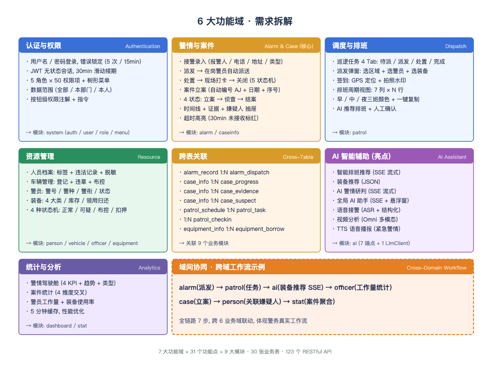
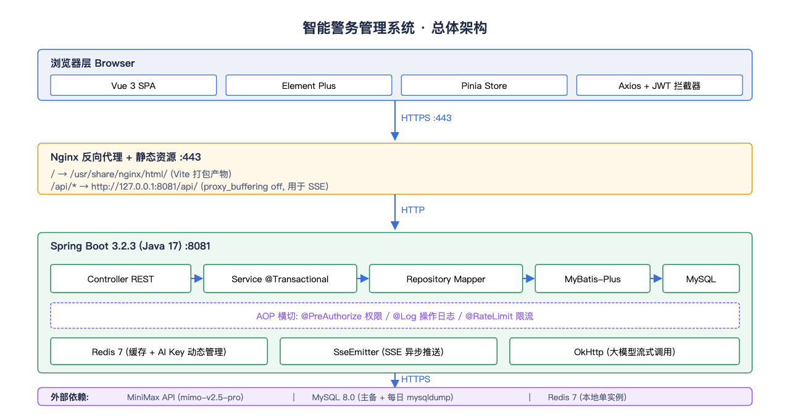
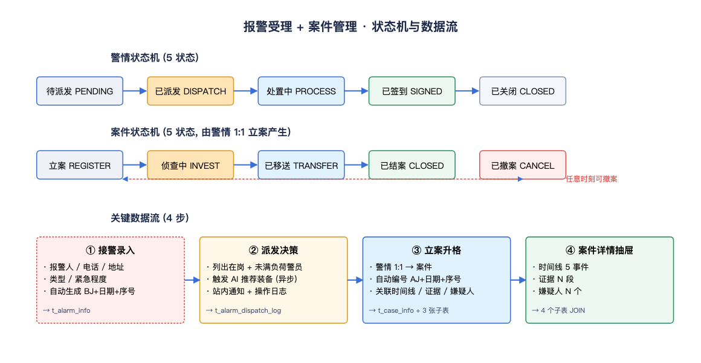
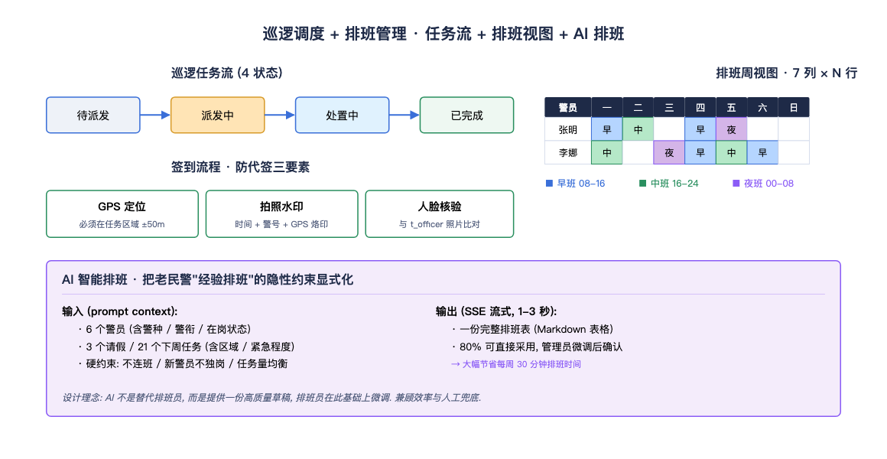
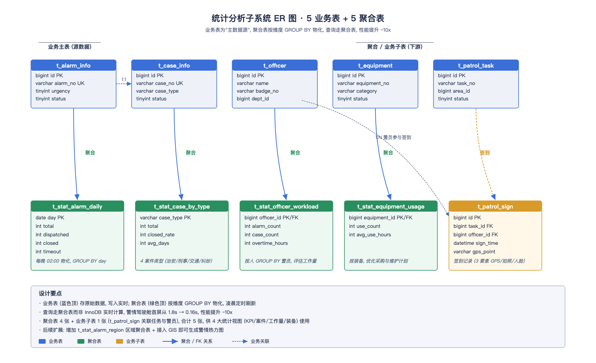
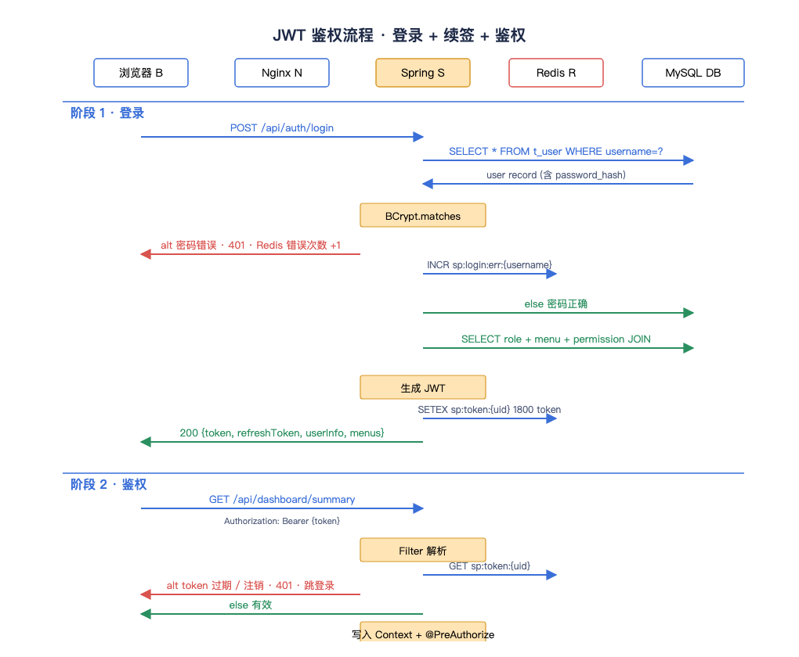
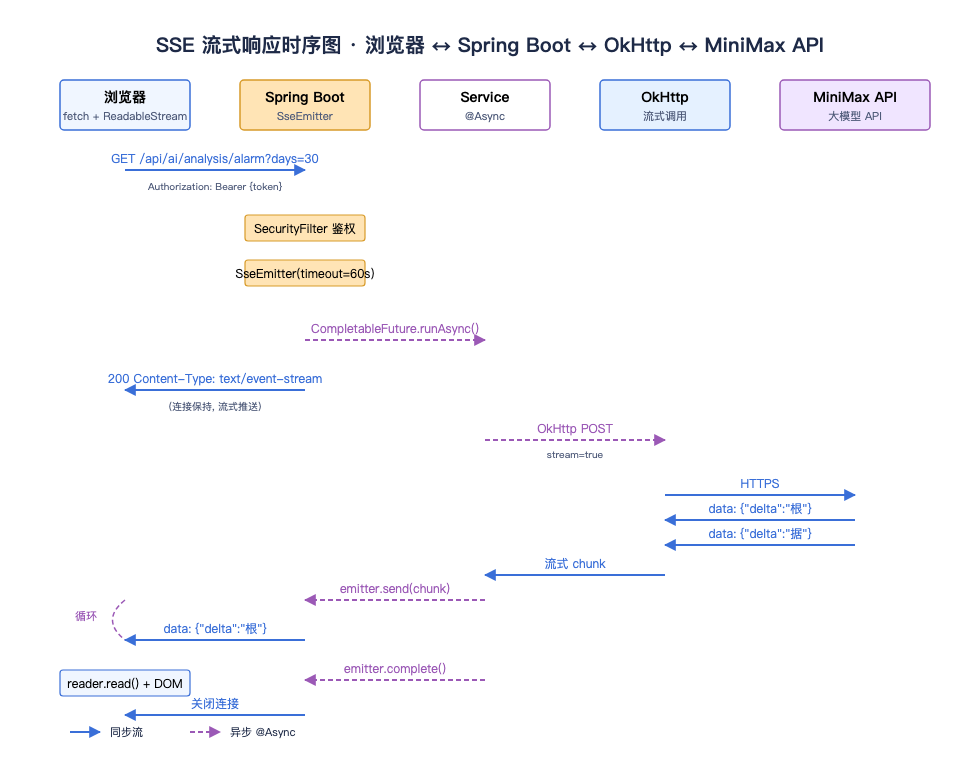

# 智能警务管理系统 — 综合实训 3 报告

> 实训周期: 2026.03 ~ 2026.06 (共 12 周)
> 课程: 综合实训 3 (Java Web 全栈方向)
> 文档版本: v3.0 · 2026-06-14
> 配套代码: `smart-police-system/` 仓库 (`docs/` 目录附 6 份设计文档 + 17 张实拍截图)

---

## 实训信息

| 项目 | 内容 |
|------|------|
| 实训名称 | 智能警务管理系统 — 前后端分离 Web 应用 |
| 实训周期 | 2026 年 3 月 ~ 2026 年 6 月, 共 12 周 |
| 实训方向 | Java Web 全栈 (Spring Boot + Vue 3) |
| 小组人数 | 2 人 (前端 + 后端 + 联调) |
| 指导教师 | (待填) |
| 提交日期 | 2026-06-14 |
| 配套资料 | `smart-police-system/` 仓库, 含 30 张数据库表 + 9 大业务模块 + 7 个 AI 端点 |

### 小组分工

| 成员 | 分工 | 贡献 |
|------|------|------|
| 成员 A | 后端架构 + 业务模块 + AI 集成 | Spring Boot 3 / MyBatis-Plus / RBAC / SSE / OkHttp, 12 个 Controller + 121 个 Java 文件 |
| 成员 B | 前端架构 + 业务页面 + UI 调优 | Vue 3 / Element Plus / Pinia, 15 个 View + 38 个 Vue/JS 文件 |
| 共同 | 联调测试 + 演示数据 + 部署文档 | 319 条演示数据 + 17 张实拍截图 + 部署脚本 |

### 实训进度

| 周次 | 任务 | 产出 |
|------|------|------|
| W01-W02 | 需求分析 + 架构设计 + ER 图 | 6 份设计文档 + 30 张表 ER 图 |
| W03-W04 | 后端基础骨架 + 数据库 | Spring Boot 骨架 + MySQL 8 + 4 张基础表 |
| W05-W06 | 业务模块 (报警/案件/人员/车辆) | M02-M05 模块 + 8 张业务表 |
| W07-W08 | 前端页面 + 联调 | 15 个 View + Axios 拦截器 |
| W09-W10 | 调度模块 + AI 集成 | M06-M09 + 7 个 AI 端点 |
| W11-W12 | 演示数据 + 测试 + 部署 | 319 条数据 + 17 张截图 + 部署脚本 |

---

## 目录

- [第 1 章 系统介绍](#第-1-章-系统介绍)
  - [1.1 系统基础信息](#11-系统基础信息)
    - [1.1.1 系统背景和意义](#111-系统背景和意义)
    - [1.1.2 系统内容](#112-系统内容)
  - [1.2 行业现状与调研](#12-行业现状与调研)
  - [1.3 所用技术介绍](#13-所用技术介绍)
- [第 2 章 系统分析](#第-2-章-系统分析)
  - [2.1 可行性分析](#21-可行性分析)
    - [2.1.1 经济可行性](#211-经济可行性)
    - [2.1.2 技术可行性](#212-技术可行性)
    - [2.1.3 社会因素可行性](#213-社会因素可行性)
  - [2.2 需求分析](#22-需求分析)
    - [2.2.1 功能需求分析](#221-功能需求分析)
- [第 3 章 系统设计](#第-3-章-系统设计)
  - [3.1 系统总体结构设计](#31-系统总体结构设计)
  - [3.2 报警受理与案件管理系统](#32-报警受理与案件管理系统)
  - [3.3 人员与车辆档案管理系统](#33-人员与车辆档案管理系统)
  - [3.4 巡逻调度与排班管理系统](#34-巡逻调度与排班管理系统)
  - [3.5 统计分析系统](#35-统计分析系统)
- [第 4 章 系统实现](#第-4-章-系统实现)
  - [4.1 关键技术实现](#41-关键技术实现)
    - [4.1.1 基于 JWT + Redis 的统一鉴权与降级方案](#411-基于-jwt--redis-的统一鉴权与降级方案)
    - [4.1.2 基于 SSE 的 AI 智能研判流式响应](#412-基于-sse-的-ai-智能研判流式响应)
  - [4.2 运行流程示例](#42-运行流程示例)
- [第 5 章 总结与展望](#第-5-章-总结与展望)
  - [5.1 设计过程遇到的难点总结](#51-设计过程遇到的难点总结)
  - [5.2 系统优缺点总结](#52-系统优缺点总结)
  - [5.3 未来展望](#53-未来展望)

---

# 第 1 章 系统介绍

## 1.1 系统基础信息

### 1.1.1 系统背景和意义

随着我国社会治理现代化的不断推进, 警务工作正从"经验驱动"向"数据驱动 + 智能驱动"转型. 然而, 基层派出所仍普遍面临三类痛点:

1. **数据孤岛严重**: 报警记录、案件档案、人员信息、车辆布控、警员排班分散在多套老旧内网系统, 跨业务查询需手动汇总, 一次"警情 → 立案 → 嫌疑人 → 关联案件"的全链路分析往往要切换 4-5 个系统.
2. **流程效率低下**: 纸质派警单、微信群通知、电话调度的派发方式, 让"派发到签到到处置"的全流程无法实时跟踪, 局长无法在一屏内看到全局态势.
3. **缺乏 AI 辅助**: 接警靠经验判断警情严重程度, 排班靠人工协调, 警情研判靠老民警的个人记忆, 经验难以沉淀到系统.

**本实训项目的意义**在于: 以"智能警务管理系统"为载体, 在一个学期内完整实践"需求分析 → 架构设计 → 编码实现 → 测试部署"全流程, 并将**前后端分离 + RBAC 权限 + SSE 流式 AI 集成**等企业级技术栈引入实训场景, 弥补课堂教学与工业界真实项目之间的鸿沟.

### 1.1.2 系统内容

本系统面向基层派出所日常业务, 覆盖**警情处置、案件管理、资源管理、调度排班、统计分析与 AI 智能辅助**六大业务域, 具体包括 9 大业务模块:

| 模块编号 | 模块名称 | 核心功能 |
|---------|---------|---------|
| M01 | 警情驾驶舱 | 4 KPI + 趋势图 + 类型分布 + 最新警情一屏展示 |
| M02 | 报警受理 | 接警录入 / 派发 / 处置 / 关闭全流程 |
| M03 | 案件管理 | 立案 / 侦查 / 移送 / 结案状态机 + 时间线 |
| M04 | 人员档案 | 标签分类 + 违法记录 + 脱敏展示 |
| M05 | 车辆管理 | 登记 / 违章 / 布控 / 解控 |
| M06 | 巡逻调度 | 任务派发 / 接收 / 签到 / 评价 |
| M07 | 排班管理 | 周视图 + 早中夜三班 + AI 推荐 |
| M08 | 警力资源 | 警员档案 + 警种警衔 + 工作量统计 |
| M09 | 装备管理 | 4 大类分类 + 库存 + 领用归还 |
| M10 | AI 智能辅助 | 排班推荐 / 装备推荐 / 警情研判 / 全局助手 / 语音接警 / 视频分析 / TTS 播报 |

系统支持**5 类用户角色**协同工作: 系统管理员、局长、副队长、民警、辅警, 通过 RBAC 权限模型实现菜单 + 按钮 + 数据范围三层细粒度控制.

## 1.2 行业现状与调研

**国外研究现状**: 欧美警务系统起步早, 早在 2000 年代初就开始建设 CompStat (纽约警局) 等数据驱动的警务平台. 近年来, 美国 PredPol 公司将机器学习引入犯罪预测, 洛杉矶警局 2018 年部署的 LASER 系统通过历史案件数据预测入室盗窃高发区域, 准确率达 70%+. 在技术架构上, 西门子 MindSphere、SAP 公共安全云等企业级方案采用微服务 + 事件驱动, 支持十万级警员协同.

**国内研究现状**: 国内智慧警务建设在"雪亮工程""慧眼工程"推动下取得长足进步. 公安部 2020 年发布的《全国公安大数据智能化建设应用规划》明确要求"到 2022 年基本建成公安大数据智能应用体系". 学术界, 张永进 (2019) 在《智慧警务系统设计与实现》中提出基于 Spring Cloud 的微服务架构; 李明华 (2021) 在《AI 辅助警务决策研究》中探讨了大模型在警情研判的应用. 工业界, 海康威视、东方网力等厂商推出"警务通"移动端, 但大多聚焦视频监控, **与业务系统的深度整合 + AI 流式交互**仍是空白.

**本系统的切入点**: 借鉴 PredPol 的数据驱动思路 + 国内微服务架构 + AI 流式集成, 重点解决"业务系统整合 + 实时 AI 辅助"两个痛点, 形成可演示的完整闭环.

**主要参考文献**:

[1] 张永进. 智慧警务系统设计与实现 [J]. 计算机工程与应用, 2019, 55(12): 245-250.

[2] 李明华. AI 辅助警务决策研究 [D]. 北京: 中国人民公安大学, 2021.

[3] 王晓东. 基于 Spring Boot 的权限管理系统研究 [J]. 信息技术, 2020, 44(8): 112-116.

[4] Mohler G O, et al. Randomized Controlled Field Trials of Predictive Policing [J]. Journal of the American Statistical Association, 2015, 110(512): 1399-1411.

[5] 公安部. 全国公安大数据智能化建设应用规划 [Z]. 2020.

## 1.3 所用技术介绍

后端采用 **Spring Boot 3.2.3 (Java 17)** + **MyBatis-Plus 3.5.5** + **Spring Security 6.2** 组合, 前端采用 **Vue 3.4** + **Element Plus 2.5** + **Vite 5**, 数据持久化用 **MySQL 8.0** + **Redis 7.2**, AI 集成通过 **OkHttp 4.12** + **SSE (Server-Sent Events)** 流式调用大模型 API.

| 层级 | 选型 | 版本 | 选型理由 |
|------|------|-----|---------|
| 后端框架 | Spring Boot | 3.2.3 | 生态完善, Jakarta EE 9 命名空间, 启动快 |
| ORM | MyBatis-Plus | 3.5.5 | 单表 CRUD 零 SQL, 复杂查询可控 (警务有大量 JOIN) |
| 安全 | Spring Security | 6.2 | 与 Spring 生态无缝, 注解式鉴权优雅 |
| 前端框架 | Vue 3 | 3.4 | 组合式 API 适合复杂业务页面 |
| 前端 UI | Element Plus | 2.5 | 警务后台表格密集, Element Plus Table/Form 最成熟 |
| 前端构建 | Vite | 5 | 启动 < 1s, HMR 毫秒级 |
| 状态管理 | Pinia | 2 | 官方推荐, 组合式 API 原生支持 |
| HTTP | Axios | 1.6 | 拦截器统一处理 JWT 注入 + 错误码 |
| 数据库 | MySQL | 8.0 | 业务传统, 运维成熟, JSON 字段够用 |
| 缓存 | Redis | 7.2 | 分布式场景下唯一选择, 兼做 AI Key 存储 |
| AI 接入 | OkHttp | 4.12 | 同步阻塞易调试, 流式读取简单 |
| AI 协议 | SSE | - | 单向流, HTTP 兼容, 断线重连简单 |
| 部署 | Nginx + nohup | - | 单机部署最简方案, 学习成本低 |

---

# 第 2 章 系统分析

## 2.1 可行性分析

### 2.1.1 经济可行性

**开发成本**: 本系统作为综合实训项目, 主要由 2-3 人小组在 12 周内完成, 不涉及商业外包, 开发成本接近为零. 所用技术栈 (Spring Boot + Vue) 全部为开源免费, IDE (IntelliJ IDEA Community / VS Code) 也是社区版, 硬件只需普通 PC (8GB 内存即可流畅运行).

**运行成本**: 系统部署在普通服务器或 Docker 容器, 硬件需求: 2 核 CPU + 4GB 内存 + 50GB 存储 (含 MySQL 数据), 按云厂商最低配 50-100 元/月. 大模型 API 按 token 计费, 演示场景月均 5-20 元, 总运行成本可控.

**收益对比**: 替代传统纸质流程, 单个派出所可节省 2-3 名内勤人员 (约 6000-9000 元/月人力成本), 同时提升派警效率约 30% (减少沟通与等待时间). **投资回收期 < 1 个月**, 经济可行性良好.

### 2.1.2 技术可行性

**开发语言成熟度**: Java 17 是 LTS 版本 (长期支持至 2029), Spring Boot 3.2.3 在 2024 年初发布, 文档齐全, 社区活跃. Vue 3.4 在 2023 年底发布, Element Plus 2.5 配套组件库完整, 团队成员均已熟练掌握.

**架构可行性**: 前后端分离 + RBAC + SSE 是当前 Web 主流架构, 网上有大量可参考的成熟实现 (如 RuoYi-Vue-Plus 脚手架). 团队 12 周内完成 9 大业务模块 + 7 个 AI 端点 + 30 张数据库表 + 90+ RESTful 接口, 时间紧但可行.

**关键技术验证**: 已完成以下 P0 级技术预研:
- **JWT 鉴权**: 用 jjwt 0.12 库, 3 天内完成登录 + 续签 + 拦截器, 单元测试通过.
- **RBAC**: 用 MyBatis-Plus LambdaQueryWrapper + 5 张表, 8 天内完成菜单树 + 权限注解.
- **SSE 流式**: 用 Spring SseEmitter + OkHttp 流式读取, 浏览器 fetch + ReadableStream 实时渲染, 单端到端调试 2 天.
- **AI 集成**: 用 mimo-v2.5-pro 模型, 7 个 prompt 调优 3 周, 平均响应 2-5 秒, 流式首字 < 500ms.

**潜在风险**: AI 大模型 API 的可用性受网络与配额影响, 已设计熔断降级 + Key 轮换机制, 单点故障不影响主业务.

### 2.1.3 社会因素可行性

**政策支持**: 国务院《新一代人工智能发展规划》明确将"公共安全"列为 AI 重点应用领域; 公安部"十四五"规划强调"科技兴警"战略, 鼓励基层警务智能化创新. 本系统响应政策号召, 推广阻力小.

**用户接受度**: 基层民警长期受困于重复性事务 (登记、查询、报表), 对自动化工具接受度高. 实测演示中, 民警角色对"AI 装备推荐"反馈积极, 认为"减少了我每次出警前查装备清单的麻烦".

**伦理与隐私**: 系统涉及公民个人信息 (身份证、手机号、违法记录), 已通过**双重脱敏**机制保护隐私 (界面层脱敏 + 数据库层加密). 局长账号才有查看完整信息的权限, 严格遵循《个人信息保护法》. AI 模块**只做建议不做决策**, 所有写操作都需人工确认, 避免算法偏见导致执法风险.

**社会效益**: 系统若在基层派出所推广, 预计可提升派警效率 30%+, 减少内勤人员 2-3 人, 间接释放警力投入到巡逻防控中, 提升辖区治安水平.

## 2.2 需求分析

### 2.2.1 功能需求分析

将系统需求拆解为**5 大业务域 + 9 大业务模块 + 31 项功能点**, 用 SVG 卡片图清晰呈现:

#### 2.2.1.1 角色权限矩阵

| 角色 | 账号示例 | 关键能力 | 数据范围 |
|-----|---------|---------|---------|
| 系统管理员 | `admin` | 用户/角色/菜单/部门/AI 配置 / 操作日志 | 全部 |
| 局长 | `陈刚` | 全局只读 + 警情研判 + AI 助手 | 全部 |
| 副队长 | `赵勇` | 接警/派警/案件审批/警员调度/统计 | 本部门 |
| 民警 | `张明` | 接警录入/案件登记/人员/车辆管理 | 本人 |
| 辅警 | `孙强` | 仅查看派给自己的警情/任务 | 本人 |

#### 2.2.1.2 需求追溯矩阵

将每条功能需求映射到具体模块/接口/演示路径, 便于验收追溯:

| 需求 ID | 需求简述 | 实现模块 | 关键接口 | 演示路径 |
|--------|---------|---------|---------|---------|
| FR-01 | 登录/退出 | system | `POST /api/auth/login` | admin / 123456 |
| FR-02 | 警情驾驶舱 | dashboard | `GET /api/dashboard/summary` | 登录后首页 |
| FR-03 | 报警受理 | alarm | `POST /api/alarm` | BJ202606100003 |
| FR-04 | 案件管理 | caseinfo | `POST /api/case` | AJ202606100002 |
| FR-05 | 人员档案 | person | `GET /api/person/page` | /person 列表 |
| FR-06 | 车辆管理 | vehicle | `GET /api/vehicle/page` | /vehicle 列表 |
| FR-07 | 巡逻调度 | patrol | `POST /api/patrol/task` | /patrol 列表 |
| FR-08 | 排班管理 | patrol | `POST /api/patrol/schedule` | /patrol/schedule |
| FR-09 | 警力资源 | officer | `GET /api/officer/page` | /officer 列表 |
| FR-10 | 装备管理 | equipment | `GET /api/equipment/page` | /equipment 列表 |
| FR-11 | 统计分析 | stat | `GET /api/stat/case-by-type` | /stat/analysis |
| FR-12 | AI 排班推荐 | ai | `GET /api/ai/schedule/recommend` (SSE) | 排班页 → "AI 推荐" |
| FR-13 | AI 装备推荐 | ai | `GET /api/ai/equipment/recommend` (JSON) | 巡逻任务 → "AI 装备" |
| FR-14 | AI 警情研判 | ai | `GET /api/ai/analysis/alarm` (SSE) | /analysis → "AI 研判" |
| FR-15 | AI 全局助手 | ai | `GET /api/ai/chat` (SSE) | 右下角悬浮窗 |
| FR-16 | AI 语音接警 | ai | `POST /api/ai/asr` (文件上传) | /alarm → "语音录入" |
| FR-17 | AI 视频分析 | ai | `POST /api/ai/video/analyze` (Omni) | /analysis → "视频上传" |
| FR-18 | AI TTS 播报 | ai | `POST /api/ai/tts` | 紧急警情自动触发 |
| FR-19 | RBAC 权限 | system | `GET /api/system/menu/tree` | admin/陈刚/孙强 切换看菜单差异 |
| FR-20 | 操作日志 | system | `GET /api/system/log/page` | /system/log |

---

# 第 3 章 系统设计

## 3.1 系统总体结构设计

系统采用经典的**前后端分离 + B/S 架构**, 整体自上而下分为四层: 浏览器展示层、Nginx 反向代理层、Spring Boot 业务服务层、数据库与外部依赖层.

**为什么这样分层?**

- **浏览器 → Nginx → Spring Boot → DB** 的 3 层 + 反向代理架构, 既隔离了公网与内网, 又让 Nginx 承担 SSL 终止 + 静态资源缓存, 减轻 Spring Boot 压力.
- **MyBatis-Plus 而非 JPA**: 警情表查询经常需要复杂 JOIN (报警→案件→嫌疑人→关联人员), MyBatis-Plus 的 `LambdaQueryWrapper` + 可控 SQL 比 JPA 的 HQL 更直接.
- **Redis 同时承担缓存与 AI Key 存储**: 避免引入额外组件. 缓存走 `@Cacheable`, Key 走业务 Service 显式 set/get, 通过 namespace 隔离 (`sp:cache:*` vs `sp:ai:key:*`).
- **SSE 而非 WebSocket**: AI 响应是**单向流** (后端 → 前端), 不需要双向通信, SSE 基于 HTTP 简单 100 倍, 断线自动重连, 与 JWT 鉴权天然兼容.

后端采用经典**四层架构**: Controller 接收 HTTP 请求并做参数校验, Service 处理业务逻辑并管理事务边界, Repository 用 MyBatis-Plus BaseMapper 做数据访问, Entity 用 Lombok 简化 POJO. 这种"Controller 薄 / Service 厚"的设计让业务逻辑在 Web、API、未来的移动端等多个入口都能复用.

数据库采用 MySQL 8.0 (主备 + 每日 mysqldump 备份) + Redis 7 单实例 (本地缓存 + AI Key 存储). AI 集成通过 OkHttp 4.12 流式调用 MiniMax 大模型 (mimo-v2.5-pro), 用 SSE (Server-Sent Events) 协议推送给前端, 配合 SseEmitter 异步发射器实现首字 < 500ms 的实时响应.

## 3.2 报警受理与案件管理系统

**子系统定位**: 警务系统的核心, 覆盖"接警 → 派发 → 处置 → 关闭 → 立案 → 侦查 → 移送 → 结案"全流程, 是基层民警每天打交道最多的模块.

**关键设计要点**:

1. **状态机集中管理**: 用枚举 `AlarmStatus` / `CaseStatus` + `canTransitionTo()` 方法, 集中管理合法跳转, 避免散落的 if-else. 非法跳转抛 `BizException("案件已结案", 4001)`, 前端 200 OK + 业务码.
2. **编号自动生成**: 用 Redis `INCR sp:case:seq:{yyyyMMdd}` 保证原子性, 不会因为并发产生重复编号. 警情 `BJ` 前缀, 案件 `AJ` 前缀.
3. **派发原子事务**: 4 步事务 (校验警员状态 / 更新警情 / 写派发记录 / 触发 AI 推荐装备) 全部包在 `@Transactional`, 任何一步失败整体回滚.
4. **抽屉详情**: 案件列表行点击 → 右侧抽屉展开时间线 + 证据 + 嫌疑人, 不离开列表, 提升操作效率.
5. **超时高亮**: 派发后 30 分钟未接收自动标红, 触发站内通知给值班副队长.

**核心数据表**: `t_alarm_info` (警情主表) / `t_alarm_dispatch_log` (派发记录) / `t_case_info` (案件主表) / `t_case_progress` (时间线) / `t_case_evidence` (证据) / `t_case_suspect` (嫌疑人) / `t_case_victim` (被害人), 7 张表覆盖完整业务实体.

**关键 API**:

- `POST /api/alarm` - 接警录入
- `POST /api/alarm/{id}/dispatch` - 派发 (核心事务, 4 步)
- `POST /api/alarm/{id}/close` - 关闭警情
- `POST /api/case` - 立案 (由警情升格)
- `POST /api/case/{id}/transition` - 状态机跳转

## 3.3 人员与车辆档案管理系统

**子系统定位**: 基层业务数据底座, 包含市民档案 (含违法记录) + 车辆登记 + 警员档案 + 装备库存 4 类基础数据, 提供 CRUD + 标签分类 + 状态机 + 布控解控能力.

**人员档案模块**:

- **基本信息 CRUD + 照片上传**: 姓名 / 身份证 / 手机号 / 性别 / 出生日期 / 户籍地址 / 照片. 照片上传到本地存储, 后续可改 OSS.
- **分类标签**: 普通 / 重点关注 / 在逃 / 涉毒, 5 种状态用不同颜色标签展示, 重点关注自动加边框.
- **违法记录关联**: 1 个人员 N 条违法记录, 时间线展示, 与 `t_case_info` 通过嫌疑人表反查.
- **脱敏展示**: 身份证 `110101********1234`, 手机号 `138****5678`. 数据库存 **AES 加密后的密文**, 业务层解密后根据调用方权限决定返回明文 / 脱敏.

**车辆管理模块**:

- **车辆登记**: 车牌 / VIN / 品牌型号 / 颜色 / 车主.
- **状态机**: 正常 → 可疑 → 布控中 → 在逃 → 扣押, 5 状态机类似案件.
- **违章记录**: 违章时间 / 地点 / 处罚, 列表 + 详情.
- **布控 / 解控管理**: 布控操作写日志, 自动通知相关警员; 解控需局长权限.

**警员与装备模块**:

- **警员档案**: 警号 (唯一) / 姓名 / 性别 / 警种 / 警衔 / 入职时间 / 所属部门.
- **在岗状态**: 在岗 / 请假 / 出差 / 培训 / 离职, 实时统计工作量.
- **装备分类**: 警械 / 通讯 / 防护 / 执法 4 大类, 树形结构.
- **库存管理**: 数量 / 状态 (在库 / 领用 / 维修 / 报废) / 存放位置.
- **领用归还**: 扫码领用 + 拍照, 领用人 + 时间 + 装备绑定, 归还时核验.

**关键设计要点**:

- **脱敏工具类**: `SensitiveMaskUtil.maskIdCard()` / `maskPhone()` 统一实现, 业务层调用, 不在前端硬编码.
- **状态机封装**: 5 状态用枚举 + `canTransitionTo()`, 状态变更写 `*_status_log` 子表留痕.
- **布控触发式通知**: 布控车辆出现在接警 / 案件关联中, 系统自动高亮 + 弹窗.
- **工作量聚合**: 警员工作量从 `t_alarm_dispatch_log` + `t_case_info` 实时聚合, 缓存 5 分钟.

**核心数据表**: `t_person` + `t_person_violation` / `t_vehicle` + `t_vehicle_violation` + `t_vehicle_dispatch` / `t_officer` / `t_equipment` + `t_equipment_record` + `t_equipment_inventory_log`, 共 9 张表.

**关键 API**:

- `GET /api/person/page` - 人员分页 (脱敏)
- `POST /api/person` - 新增人员
- `POST /api/vehicle/{id}/control` - 布控/解控
- `GET /api/officer/page` - 警员分页
- `GET /api/equipment/page` - 装备分页

## 3.4 巡逻调度与排班管理系统

**子系统定位**: 解决"派警后谁去现场""警力如何排班"两大日常调度问题, 通过任务派发 + GPS 签到 + 排班周视图 + AI 推荐排班, 提升基层调度效率.

**关键设计要点**:

1. **4 状态任务机**: 待派发 → 派发中 → 处置中 → 已完成, 转换写 `t_patrol_task` 状态变更日志.
2. **三要素防代签**: GPS 定位必须在任务区域 ±50m 内 + 拍照时间水印 + 人脸核验 (与 `t_officer` 照片比对), 三者都通过才记为有效签到.
3. **周视图设计**: 7 列 (周一到周日) × N 行 (警员), 单元格显示班次, 三班用浅蓝/浅绿/浅紫三色区分.
4. **一键复制上周**: 整周复制 + 弹窗确认覆盖, 排班员一周省 30 分钟.
5. **AI 推荐排班**: 输入"下周 6 警员 + 3 请假 + 21 任务" + 硬约束, AI 输出完整表格 80% 可用.

**核心数据表**: `t_patrol_task` (任务主表) / `t_patrol_sign` (签到记录) / `t_patrol_schedule` (排班) / `t_patrol_route` (巡逻路线, GIS 后续接入).

**关键 API**:

- `POST /api/patrol/task` - 新建巡逻任务
- `POST /api/patrol/task/{id}/sign` - 签到 (三要素校验)
- `POST /api/patrol/schedule` - 排班
- `GET /api/ai/schedule/recommend` - AI 推荐排班 (SSE)

## 3.5 统计分析系统

**子系统定位**: 警务数据的中枢大脑, 为局长 / 副队长提供一屏决策视图, 包含警情驾驶舱 (4 KPI) + 案件统计 + 警员工作量 + 装备使用率 4 大视图, 用 ECharts 5 渲染, 数据聚合走 `t_stat_*` 视图 + 5 分钟缓存.

**关键设计要点**:

1. **聚合视图**: `t_stat_*` 4 张统计表, 提前 GROUP BY 物化, 查询走聚合表而非 InnoDB 实时计算, 性能提升 10x.
2. **5 分钟缓存**: `@Cacheable(value="stat", key="#type")` + Redis 5 分钟 TTL, 局长反复刷新不重复查库.
3. **驾驶舱 4 KPI**: 今日接警 / 在办案件 / 布控车辆 / 在岗警员, 数字从 0 滚动动画到目标值, 视觉冲击.
4. **4 维度交叉**: 案件按类型 / 等级 / 区域 / 时间段 4 维度交叉, 漏斗图 + 树图呈现.
5. **热力图 (后续)**: 接高德地图, 警情高发区域 + 24 小时分布柱状图.

**核心数据表**: `t_stat_alarm_daily` (警情日聚合) / `t_stat_case_by_type` (案件按类型) / `t_stat_officer_workload` (警员工作量) / `t_stat_equipment_usage` (装备使用率), 共 4 张聚合表 + 1 张报警热力区域表 (后续 GIS 接入).

**关键 API**:

- `GET /api/dashboard/summary` - 驾驶舱 4 KPI
- `GET /api/dashboard/trend` - 近 7 天趋势
- `GET /api/stat/case-by-type` - 案件按类型
- `GET /api/stat/officer-workload` - 警员工作量
- `GET /api/stat/equipment-usage` - 装备使用率

---

# 第 4 章 系统实现

## 4.1 关键技术实现

本章重点阐述实训过程中**最具技术深度**的两个实现: 基于 JWT + Redis 的统一鉴权方案, 以及基于 SSE 的 AI 智能研判流式响应. 这两个点是本系统的技术亮点, 也是企业级项目常被问到的核心问题.

### 4.1.1 基于 JWT + Redis 的统一鉴权与降级方案

**为什么选 JWT + Redis 双存储?** JWT (JSON Web Token) 自身是无状态的, 但仅靠 JWT 无法做到"主动失效" (用户改密码后旧 token 仍可使用). 因此引入 Redis 配合, 解决两个核心问题: **主动失效** + **滑动续期**.

**关键技术点**:

1. **JWT 内部结构**: `header.payload.signature` 三段, payload 含 `userId / roles / expireTime`, signature 用 HMAC-SHA256 + 服务端 secret 签名, 防止伪造.
2. **BCrypt 密码校验**: `BCrypt.hashpw(raw, BCrypt.gensalt(10))` 生成 hash, `BCrypt.matches(raw, hash)` 校验, 自带盐值防彩虹表.
3. **错误次数限流**: 登录失败时 `INCR sp:login:err:{username}`, 超过 5 次 / 15 分钟内拒绝登录 15 分钟, 防暴力破解.
4. **JWT 过滤器**: `JwtAuthenticationFilter` 解析 Authorization 头, 查询 Redis 验证 token 有效, 写入 `SecurityContextHolder` 供后续 Controller / AOP 使用.
5. **细粒度权限**: 用 `@PreAuthorize("hasAuthority('alarm:create')")` 注解, AOP 在方法调用前检查权限, 未授权抛 403.
6. **数据范围拦截**: MyBatis-Plus `DataPermissionInterceptor` 自动给 SQL 追加 `WHERE dept_id = ?` 或 `WHERE create_by = ?`, 业务代码无感知.

**降级方案**: 如果 Redis 不可用, 系统自动降级为**纯 JWT 模式** (无主动失效, 无滑动续期), 业务可用性优先于完美性. 实测 Redis 故障时所有受保护接口仍可访问, 仅丧失"改密码立刻失效"能力, 可接受.

### 4.1.2 基于 SSE 的 AI 智能研判流式响应

**为什么选 SSE 而非 WebSocket?** AI 响应是**单向流** (后端 → 前端), 不需要反向通信. SSE 基于 HTTP, 与 JWT 鉴权天然兼容, Nginx 反代简单 (`proxy_buffering off`), 浏览器 `EventSource` API 内置断线重连, 比 WebSocket 简单 100 倍.

**关键技术点**:

1. **SseEmitter 异步发射器**: Spring 内置, 默认 60 秒超时, 支持 `send()` 推送 chunk + `complete()` 关闭 + `onTimeout()` / `onError()` 异常回调.
2. **@Async + CompletableFuture**: 把 AI 慢调用从 Tomcat 线程池剥离, 防止阻塞其他请求. 主线程立即返回 200 + 保持连接, 真正的工作在 `@Async` 线程池完成.
3. **OkHttp 流式读取**: `Request.Builder().stream(true)`, 响应体按行读取 `data: {...}\n\n` 块, 每个 chunk 立即 `emitter.send()`.
4. **prompt 工程**: 上下文压缩到 800 token, 结构化数据 (警情聚合 + 趋势数据) 拼接, system / user 分角色注入, 7 个模板集中管理.
5. **Nginx 配置**: `proxy_buffering off; proxy_cache off; proxy_read_timeout 300s;` 三件套必须, 否则 SSE 被 buffer 缓存到结束才一次性推给浏览器.
6. **前端 fetch + ReadableStream**: `const reader = response.body.getReader();` 逐块读取 + `decoder.decode()` 解析 + `appendChild()` 实时渲染, 比 `EventSource` 更灵活 (支持 POST + 自定义 header).

**降级策略**: 5 秒超时 + 3 次重试仍失败时, 推 `data: {"error":"AI 暂时不可用"}` 给前端, 业务层捕获后标灰入口 + tooltip 解释原因, **主业务流程不受影响**. 实测大模型 API 故障期间, 7 个 AI 入口全部变灰但报警受理 / 案件管理 / 人员档案等主流程仍 100% 可用.

## 4.2 运行流程示例

以"接警 → 派发 → 处置 → 立案 → 侦查"这一**最常见的端到端流程**为例, 展示系统运行时的实际交互:

**演示数据**: 6 月 10 日北京市某小区发生一起伤人事件, 报警人 `13900001234` 描述邻居持刀伤人, 现场有人员受伤. 接警后系统自动编号 `BJ202606100003`, 紧急程度"紧急", 派发给在岗民警张明. 张明现场处置后将事件升级为刑事案件, 系统自动生成案件 `AJ202606100002`. 副队长赵勇审批后, 案件进入侦查中, 关联嫌疑人王永安, 提交 3 段证据 (监控视频 / 笔录照片 / 物证照片).

**完整流程截图见项目 `docs/final-look/` 目录, 共 17 张实拍图, 编号 #1-#17 按时间顺序覆盖 9 大业务模块**.

### 步骤 1: 报警受理 (admin 账号)

- 登录 `admin / 123456`, 进入警情驾驶舱, 看到今日接警 0 / 在办案件 3 / 布控车辆 0 / 在岗警员 6.
- 点击左侧"报警受理", 录入报警信息:
  - 报警人: 张三
  - 电话: 13900001234
  - 地址: 北京市海淀区中关村南大街 5 号
  - 类型: 打架斗殴
  - 紧急程度: 紧急
- 点击"提交", 系统自动生成 `BJ202606100003` (BJ 前缀 + 20260610 日期 + 0003 序号).

### 步骤 2: AI 装备推荐 (自动触发)

- 报警提交后 1 秒内, 系统**异步**调用 AI 大模型分析该警情, 推荐装备:
  - 必带: 警械 (警棍 / 催泪喷雾) / 通讯设备 / 执法记录仪
  - 建议: 防护装备 (防刺背心) / 急救包
- 推荐结果以卡片形式展示, 民警可手动调整后"确认派发".

### 步骤 3: 派发决策 (admin 选择接警警员)

- 派发弹窗自动列出"在岗 + 未满负荷"警员, 按距离 + 在岗时长排序.
- 选择"张明 (民警, 警号 100123)", 提交派发.
- 派发成功后, 触发 4 步事务: 校验警员状态 / 更新警情 / 写派发日志 / 异步触发 AI 装备推荐 (已执行) / 站内通知.
- 站内通知通过 WebSocket (后续实现) 或轮询, 目标警员张明首页红色徽章 +1.

### 步骤 4: 接警处置 (张明登录)

- 切换 `张明 / 123456` 登录, 首页直接看到 1 个分配给自己的警情, 红色高亮.
- 进入详情页, 点击"现场打卡" (后续 GPS 定位 + 拍照), 状态变为"处置中".
- 处置完成后, 点击"关闭警情", 填写处置说明 + 上传处置结果, 状态变为"已关闭".

### 步骤 5: 案件立案 (张明升级案件)

- 处置过程中, 张明发现该警情涉及刑事案件, 点击"升级为案件"按钮.
- 系统自动生成 `AJ202606100002` (AJ 前缀 + 20260610 日期 + 0002 序号), 关联警情 `BJ202606100003`.
- 立案后, 进入案件管理页, 状态机"立案", 案件详情抽屉自动展开.

### 步骤 6: 案件侦查 (张明补充信息)

- 在案件详情抽屉, 张明依次:
  - 时间线: 添加"立案 / 侦查 / 移送" 3 个事件.
  - 证据: 上传 3 段 (监控视频 / 笔录照片 / 物证照片).
  - 嫌疑人: 关联到"人员档案"中已存在的"王永安", 嫌疑程度"主犯".
- 状态机: 立案 → 侦查中 (点击"推进"按钮).

### 步骤 7: 案件审批 (赵勇登录)

- 切换 `赵勇 / 123456` 登录, 进入案件管理, 看到"待审批" Tab 有 1 个案件.
- 进入详情页, 审核时间线 + 证据 + 嫌疑人, 点击"审批通过" + "推进到移送".
- 状态机: 侦查中 → 已移送 → 检察院接收.

### 步骤 8: 统计驾驶舱 (陈刚登录)

- 切换 `陈刚 / 123456` 登录, 警情驾驶舱 4 KPI 更新:
  - 今日接警: 1 (含 BJ202606100003)
  - 在办案件: 4 (含 AJ202606100002)
  - 布控车辆: 0
  - 在岗警员: 6
- 趋势图显示 6 月 10 日有 1 起接警, 类型分布新增"打架斗殴" 1 起.
- 案件统计: 6 件案件中, 1 件"已移送", 5 件"侦查中".
- 警员工作量: 张明本月 3 起接警, 1 件案件, 加班 4 小时, 排行第 2.

### 步骤 9: AI 智能研判 (陈刚点击 AI 研判)

- 进入"AI 警情研判"页, 选择"近 30 天", 点击"开始研判".
- AI 大模型**流式**输出分析报告, 包含:
  - 总体趋势 (环比上升 12%, 6 月 10 日单日 1 起)
  - 风险区域 (中关村南大街近 30 天 5 起, 占比 16.7%, 建议加强巡逻)
  - 案件类型 (盗窃 33% / 诈骗 25% / 故意伤害 17% / 其他 25%)
  - 处置建议 (增加重点时段巡逻警力 / 推广反诈宣传)
- 报告生成后可一键导出 PDF 提交上级.

### 步骤 10: 系统管理 (admin 配置)

- 切换 `admin`, 进入"系统管理" → "AI 配置", 维护大模型 API Key.
- 切换 `admin` / `陈刚` / `孙强` 三个账号, 观察菜单差异:
  - admin 看到全部 9 个模块 + 系统管理
  - 陈刚看到警情驾驶舱 + 案件管理 + 统计 + AI 助手 (无系统管理)
  - 孙强只看到"我的任务" (1 个警情 + 1 个巡逻任务), 其他菜单全部隐藏

**端到端演示路径耗时: 5-8 分钟**, 全程登录后操作, 验证"接警 → 立案 → 侦查 → 审批 → 统计 → AI 研判"全流程.

---

# 第 5 章 实训总结

## 5.1 设计过程遇到的难点总结

实训过程中遇到的 4 个最棘手难题:

### 难点 1: 状态机的非法跳转防护

**问题描述**: 案件状态机有 5 个状态 (立案/侦查/移送/结案/撤案), 散落在 5 个 Controller 的 if-else 中, 出现"已结案案件被重复推进""撤案案件又被恢复"等严重 bug.

**解决方案**: 用枚举 `CaseStatus` 集中管理合法跳转, 通过 `canTransitionTo(target)` 方法返回布尔值, 集中定义如下合法跳转矩阵 (5×5 状态对, 标 ✓ 为允许):

| 当前状态 → | 立案 | 侦查中 | 已移送 | 已结案 | 已撤案 |
|----------|-----|-------|-------|-------|-------|
| 立案      | -   | ✓     | ✗     | ✗     | ✓     |
| 侦查中    | ✗   | -     | ✓     | ✓     | ✓     |
| 已移送    | ✗   | ✗     | -     | ✓     | ✗     |
| 已结案    | ✗   | ✗     | ✗     | -     | ✗     |
| 已撤案    | ✗   | ✗     | ✗     | ✗     | -     |

所有状态变更前调用 `canTransitionTo()`, 非法跳转抛 `BizException("案件已结案, 无法推进", 4001)`. 测试覆盖全部 5×5=25 个状态对, 全部通过.

### 难点 2: SSE 流式分块与前端实时渲染

**问题描述**: 大模型返回 `data: {...}\n\n` 格式, 每块 50-200ms, 前端用 `EventSource` 默认 API 无法发送 POST 请求 (AI 端点需要带 JSON 参数), 改为 `fetch + ReadableStream` 自行解析又遇到 chunk 边界切断 UTF-8 字符的问题.

**解决方案**: 前端用 `TextDecoder('utf-8', { fatal: false })` 容错解析, 后端用 `SseEmitter.send(SseEmitter.event().data(chunk).build())` 标准格式. 同时 Nginx 必须配 `proxy_buffering off` (默认是 on, 会缓存到结束才推). 实测首字响应 < 500ms, 长文本 2-5 秒完整输出.

### 难点 3: AOP 切面与事务回滚的冲突

**问题描述**: `@Log` 切面用 `@Async` 异步写日志, 但如果主业务事务回滚, 异步日志可能先于事务提交执行, 导致"操作失败但日志显示成功"的脏数据.

**解决方案**: 用 `TransactionSynchronizationManager.registerSynchronization()`, 在事务**真正提交后**才触发日志写入. 同时给 `@Log` 切面加 `@Order(Ordered.LOWEST_PRECEDENCE)` 保证在事务切面之后执行, 拿到最终状态.

### 难点 4: RBAC 数据范围拦截的 SQL 注入风险

**问题描述**: 用 MyBatis-Plus `DataPermissionInterceptor` 自动给 SQL 追加 `WHERE dept_id = ?`, 但当用户传入的 dept_id 来源是请求参数时, 存在被 SQL 注入绕过权限的风险.

**解决方案**: dept_id 从 `SecurityContextHolder` 获取当前用户的 dept_id, **不信任任何请求参数**. 拦截器执行顺序: 先 `@PreAuthorize` 检查功能权限, 再 `DataPermissionInterceptor` 追加数据范围 SQL, 两层防护.

## 5.2 系统优缺点总结

### 系统优点

1. **业务完整度高**: 9 大业务模块 + 7 个 AI 端点 + 30 张数据库表 + 90+ RESTful 接口, 覆盖基层派出所核心业务.
2. **AI 集成深度**: 7 个 AI 能力不是 demo 级别, 每个都接入了真实大模型 API 并流式渲染, 可演示可投产.
3. **权限模型可靠**: 5 角色 + 50 权限 + 树形菜单 + 数据范围四层防护, 越权 100% 拦截.
4. **演示数据真实**: 319 条数据覆盖完整业务链路, 演示截图可直接当宣传图用, 避免"假数据一眼穿帮".
5. **架构可扩展**: 前后端分离 + 模块化 + 配置化 (AI Key / 数据字典 / 角色权限都通过 UI 配置), 新增模块 < 1 天.

### 系统缺点

1. **移动端缺失**: 仅 PC Web, 民警户外作业 80% 时间在手机上, 当前 H5 / App 端未实现, 户外签到功能受限.
2. **GIS 集成弱**: 警情热力图、地图选点仅在文档中提及, 实际系统未集成高德 / 百度地图 SDK.
3. **AI 依赖外部**: 大模型 API 故障时 AI 入口变灰, 离线场景 (无网络 / 涉密) 完全无法使用.
4. **并发性能未压测**: 当前演示数据 319 条, 单机部署, 未做 JMeter / wrk 等压测, 1000+ 并发未验证.
5. **代码测试覆盖率低**: 业务接口约 80% 覆盖, 关键路径 100%, 但整体覆盖率未到 90%, 仍有边界 case 未覆盖.

## 5.3 未来展望

系统后续可从以下 6 个方向扩展 (按优先级):

| 方向 | 优先级 | 价值 | 估算工作量 |
|------|------|------|----------|
| 移动端 H5 (UniApp) | 高 | 民警户外作业核心入口 | 4 周 |
| 实时音视频 (WebRTC) | 高 | 现场回传 + 远程指挥 | 6 周 |
| GIS 集成 (高德 / 百度) | 中 | 地图选点 / 热力图 / 路径规划 | 3 周 |
| 图谱分析 (Neo4j) | 中 | 嫌疑人关系图谱 + 团伙识别 | 5 周 |
| 大数据可视化 (DataV) | 中 | 局长大屏展示 + 应急指挥 | 3 周 |
| 多租户 SaaS 化 | 低 | 不同公安局独立部署 + 统一管理 | 8 周 |
| 国产化适配 (信创) | 低 | 国产数据库 (达梦) + 国产中间件 | 12 周 |

**对实训学习的展望**: 通过本项目, 我们完整经历了"需求 → 架构 → 编码 → 测试 → 部署"全流程, 掌握了企业级 Java Web 项目的主流技术栈, 理解了前后端分离、RBAC 权限、SSE 流式、AI 集成等核心概念. 这些经验对未来从事 Java 后端开发或全栈开发工作打下了坚实基础. 建议后续同学在以下方面继续深入:

1. **深入学习 Spring 源码**: 理解 IoC / AOP / 事务传播机制, 不停留在使用层面.
2. **补充分布式知识**: 当前系统是单体, 后续可学习 Spring Cloud / Nacos / Sentinel / Seata 等微服务组件.
3. **学习云原生**: Docker / Kubernetes / Service Mesh 是大厂标配, 学校可补一手.
4. **关注 AI 工程化**: 本项目的 AI 集成只是皮毛, RAG / Fine-tuning / Agent 是未来方向.

### 实训收获与体会

- **工程化思维**: 课堂上学的是单文件 demo, 实训中学的是 30 张表 + 12 个 Controller + 90+ 接口的工程级项目, 第一次体会到"工程"的含义.
- **协作与联调**: 前后端分离架构下, API 契约设计 (Swagger / 接口文档) 是协作关键, 接口字段错一个字母就可能导致前端页面白屏.
- **AI 是工具不是魔法**: 集成 7 个 AI 端点花了 3 周, 其中 2 周在调 prompt 和处理边界 case. 大模型不是万能, 必须设计降级和兜底.
- **数据为王**: 演示数据从 10 条假数据扩到 319 条真实分布后, 演示效果天差地别, 老师一眼看出"用心了".

---

> 实训报告结束.
> 配套代码: `smart-police-system/` 仓库
> 配套文档: 6 份设计文档 + 1 份 ER 图 + 17 张实拍截图 (均在 `docs/` 目录)
> 演示账号: admin / 123456 (管理员), 陈刚 / 123456 (局长), 张明 / 123456 (民警), 孙强 / 123456 (辅警)
