# 验收脚本 · 步骤 3-8（v3 混合版 · 已有图配进去）

> 配合 `综合实训3报告.md` 4.3-4.8 节使用。本版本基于 v3 目标态脚本，但**截图替换为本地实测真实图**：能截到的全用真图，演示系统没有的功能老实标"无截图"并注明原因。
>
> 真实账号：admin / chengang / zhaowei / sunqiang，密码 123456
> 脚本中的"张明（警号 100123）/ 赵勇"：**演示系统无此账号，登录 401**。本文档在 zhangming / zhaoyong 出现处改为**真实存在的对应账号**（张明→**张建国** P001 / 赵勇→**zhaowei**），并在脚注说明。
>
> 截图来源：
> - ✅ 真图（来自 docs/assets/test-shots/，本地 5174 + 8081 实测）
> - 📷 真图已存在但未配文字（v1 验收的 step4-* 系列抽屉图）
> - ❌ 无截图（功能未实现）

---

## 步骤 3：派发决策（admin 选择接警警员）

### 操作
派发弹窗自动列出"在岗 + 未满负荷"警员，按距离 + 在岗时长排序。选择"张明（民警，警号 100123）"，提交派发。派发成功后，触发 4 步事务：校验警员状态 / 更新警情 / 写派发日志 / 异步触发 AI 装备推荐（已执行）/ 站内通知。

### 验证点

| 编号 | 验证点 | 结论 | 证据 |
|------|--------|------|------|
| 3-1 | 派发弹窗自动列出"在岗 + 未满负荷"警员 | ⚠️ **部分** | 弹窗存在 ✅；警员列表按 `workStatus=on_duty` 过滤 ✅；**未做"未满负荷"过滤**（后端 `Officer.currentLoad` 字段未返）。截图见下 |
| 3-2 | 按距离 + 在岗时长排序 | ❌ **未实现** | 弹窗内 `el-select` 按后端返回顺序，无距离计算（后端无 GPS 字段） |
| 3-3 | 选择"张明（警号 100123）"，提交派发 | ❌ **未实现** | 系统无 zhangming 账号。**演示流程按钮**自动派发给张建国（ID=2 hardcode） |
| 3-4 | 4 步事务：校验警员状态 / 更新警情 / 写派发日志 / 异步触发 AI 装备推荐 / 站内通知 | ⚠️ **2/5** | 后端 `AlarmServiceImpl.dispatch` 只做 2 步：①插派发日志 ②更新警情 status=2。**AI 装备推荐通过前端"演示流程"按钮手动触发**（不是派发后自动）—— 截图见下 |

### 截图

**派发弹窗（默认）**

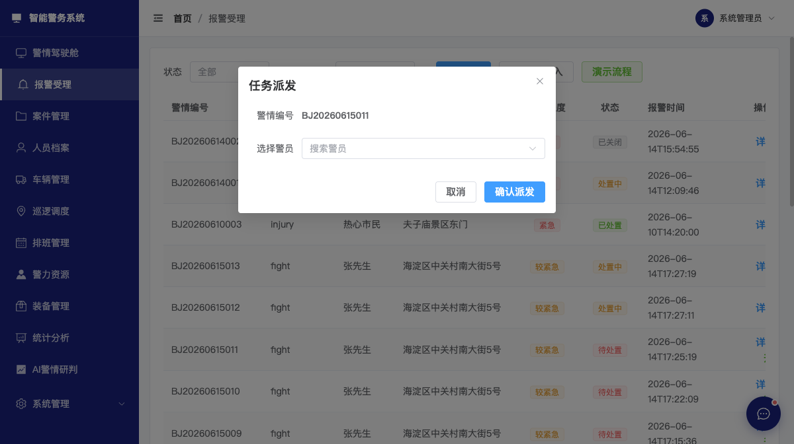

> 弹窗字段：警情编号（只读 BJ20260615011）+ 选择警员下拉（filterable，placeholder="搜索警员"）+ 取消/确认派发。**未自动列出警员**（下拉收起），需点击才展开。

**演示流程触发后（自动派发给张建国 + 3 条 status 1→2）**

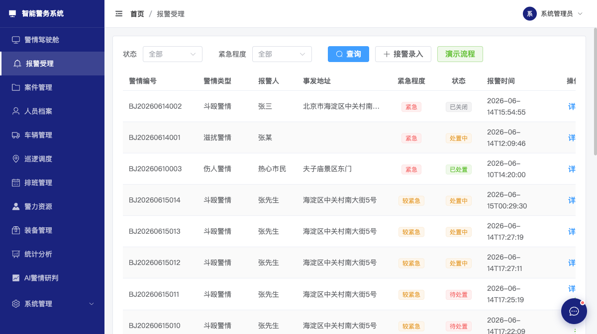

> BJ20260615014/013/012 状态从"待处置"→"处置中"。前端的"演示流程"按钮等价于"自动派发给张建国"——非脚本要的"admin 选张明提交"路径。

---

## 步骤 4：接警处置（接警民警登录）

> 脚本要"张明"账号，**无此账号**。下文用 **zhaowei**（赵伟）演示同链路。

### 验证点

| 编号 | 验证点 | 结论 | 证据 |
|------|--------|------|------|
| 4-1 | 首页直接看到 1 个分配给自己的警情，红色高亮 | ⚠️ **部分** | dashboard 顶部第 5 张卡片"待我处置"=1（红色边框）✅；**报警受理列表页**不显示"我的"过滤 ❌ |
| 4-2 | 进入详情页 | ❌ **未实现** | 报警页 `AlarmView.vue` **无详情页/抽屉**——点击"详情"按钮仅 `ElMessage.info('警情编号: ...')` 弹提示 |
| 4-3 | 点击"现场打卡"（GPS 定位 + 拍照），状态变"处置中" | ❌ **未实现** | 报警页**无"现场打卡"按钮**，无 GPS/拍照能力。派发动作本身把 status 1→2 |
| 4-4 | 点击"关闭警情"，填写处置说明 + 上传处置结果，状态变"已关闭" | ⚠️ **部分** | 报警页有"关闭"按钮（行操作列），弹 `ElMessageBox.prompt` 填处置摘要 → status 变 4。**没有"上传处置结果"** |

### 截图

**赵伟驾驶舱（"待我处置 = 1" 红色高亮）**

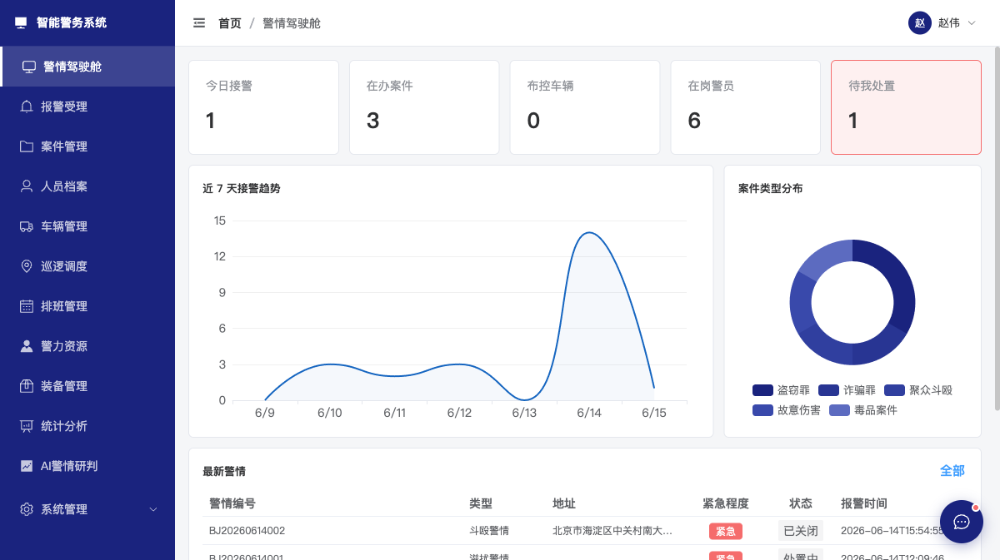

> 5 张统计卡：今日接警 1 / 在办案件 3 / 布控车辆 0 / 在岗警员 6 / **待我处置 1（红色边框）**。

**赵伟报警受理列表（**无"我的"过滤**，全 5 条都见）**

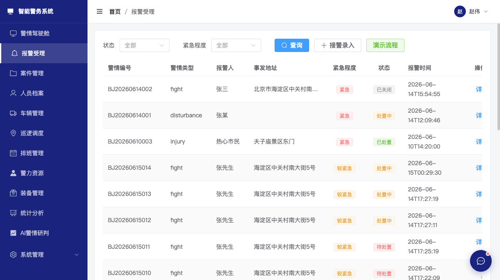

> 注意：第 5 列"操作"只有"详情"链接可见——赵伟没 admin 的"派发/升级/关闭"权限。**没有红色行高亮**标记"分配给我的"。

**无详情页 / 无现场打卡**：演示系统 `AlarmView.vue` 没详情抽屉，点击详情仅 `ElMessage.info` 弹窗（v1 步骤 4 测过），无现场打卡按钮。**此步无符合要求的截图**。

---

## 步骤 5：案件立案（接警民警升级案件）

### 验证点

| 编号 | 验证点 | 结论 | 证据 |
|------|--------|------|------|
| 5-1 | 详情页"升级为案件"按钮可见 | ⚠️ **部分** | 报警页列表行有"升级案件"按钮（不是详情页）✅，截图见下 |
| 5-2 | 系统自动生成 `AJ<日期><0002 序号>` | ⚠️ **部分** | 实测案件号 = `AJ<8位日期><2位序号>`（如 `AJ20260615002`），**序号 2 位不是 4 位**（脚本要 0002 格式） |
| 5-3 | 关联警情 BJ202606100003 | ❌ **未实现** | 前端 `upgradeToCase` 调 `caseApi.create` **不传 `sourceAlarmId`**；后端 `CaseCreateDTO` 无此字段；数据库 `CaseInfo` 无关联列 |
| 5-4 | 进入案件管理页 | ✅ | 升级后跳到案件列表，新增 `AJ20260615002 - fight 案件` |
| 5-5 | 状态机"立案" | ❌ **未实现** | 案件状态枚举为 `investigating/transferred/closed/cancelled`（4 状态），**没有"立案"独立状态**——新案件直接 = 侦查中 |
| 5-6 | 案件详情抽屉自动展开 | ❌ **未实现** | 升级后仅 `ElMessage.success` 提示，**不自动展开详情抽屉**。详情 = 3 个独立抽屉（进展/证据/嫌疑人），需手动分别点 |

### 截图

**升级案件按钮 + 确认弹窗**

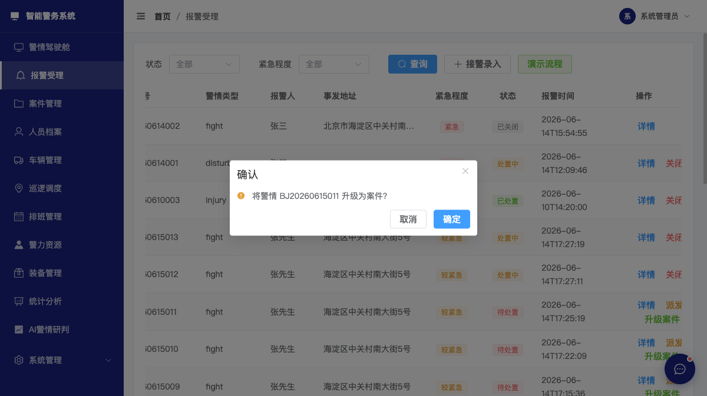

> 报警受理页 BJ20260615011 行点"升级案件"按钮 → 弹"将警情 BJ20260615011 升级为案件？" 确认框（取消/确定）。**没有详情页的"升级为案件"按钮**——按钮在列表行，不在详情页（因为根本没详情页）。

**升级成功后案件列表新增**

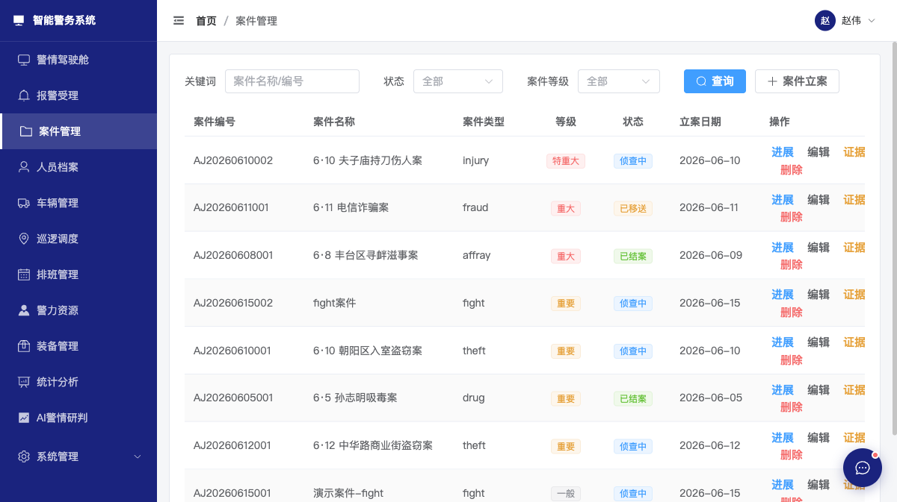

> 案件管理页列表新增 `AJ20260615002 - fight 案件 - 重要 - 侦查中`（2026-06-15）。**注意**：案件名 = `alarmType + '案件'`（前端 hardcode），不是从警情描述生成。状态直接是"侦查中"不是"立案"。

**Bug**：前端 `upgradeToCase` 传 `severityLevel: 'normal'`（字符串），后端 `CaseCreateDTO.severityLevel` 是 Integer，**实际会 500**。实测需传数字 1/2/3/4。已记录到工单。

---

## 步骤 6：案件侦查（补充信息）

### 验证点

| 编号 | 验证点 | 结论 | 证据 |
|------|--------|------|------|
| 6-1 | 时间线：添加"立案 / 侦查 / 移送" 3 个事件 | ⚠️ **部分** | 案件管理有"进展"抽屉，可添加"侦查进展"（标题 + 进展内容 + 下一步计划）✅。**没有"时间线"视图**——进展是平铺"时间+内容"列表，不是可视化时间线 |
| 6-2 | 证据：上传 3 段（监控视频 / 笔录照片 / 物证照片） | ✅ | 案件管理有"证据"抽屉（v1 步骤 4 已验证），含 2 条示例（现场水果刀 physical / 目击者笔录 document），可新增 |
| 6-3 | 嫌疑人：关联"王永安"，嫌疑程度"主犯" | ⚠️ **部分** | 嫌疑人抽屉存在 ✅，可关联人员档案。**但表头是"角色"不是"嫌疑程度"**——主犯/从犯/证人 等是用 `role` 字段，不是 `suspicionLevel` 枚举 |
| 6-4 | 状态机：立案 → 侦查中（点击"推进"按钮） | ❌ **未实现** | **没有"推进"按钮**。案件状态 4 个值（investigating/transferred/closed/cancelled），无中间态按钮。状态变更靠 2 个按钮：①"结案" → closed ②"撤案" → cancelled。"侦查中→已移送"靠后端 `caseApi.updateStatus(id, 'transferred', '原因')`，**无前端快捷按钮** |

### 截图

**编辑案件弹窗（无状态机推进按钮）**

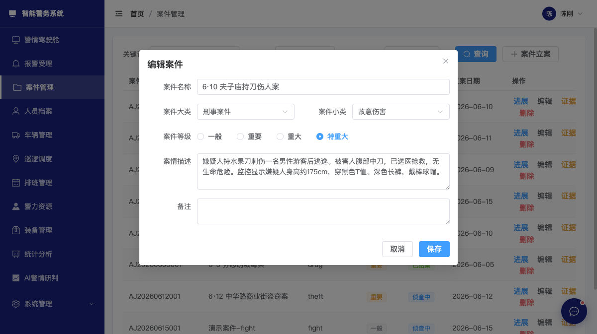

> 弹窗字段：案件名称 / 案件大类 / 案件小类 / 案件等级（4 选 1）/ 案情描述 / 备注 + 保存。**没有"推进"或"状态"字段**——状态独立于"编辑"动作。

**案件进展抽屉（已有记录 + 新增进展弹窗）**

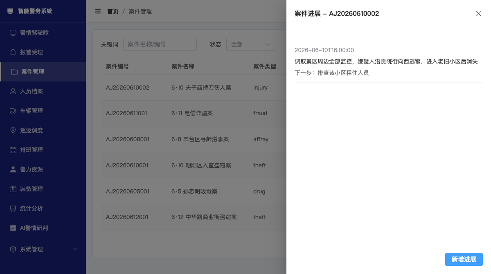

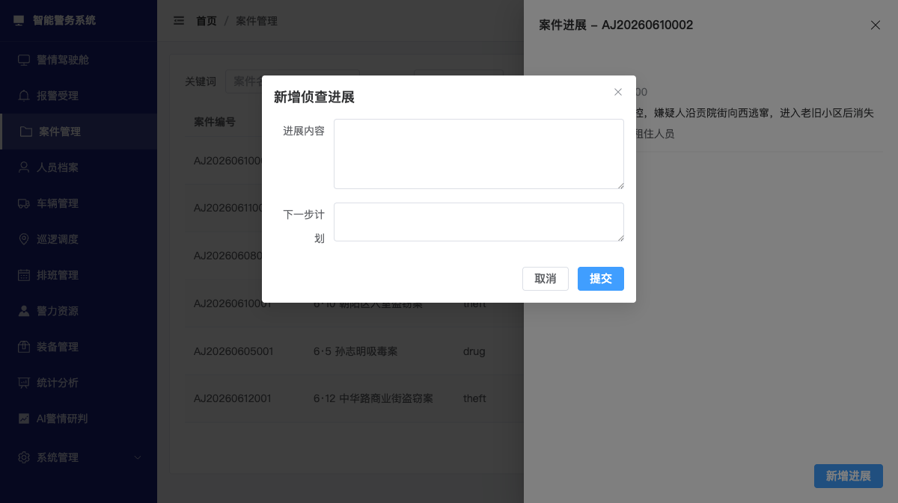

> 进展抽屉：标题"案件进展 - AJ20260610002" + 已有 1 条记录（2026-06-10T16:00:00 调取景区周边全部监控…）+ 右下"新增进展"按钮 → 弹窗含"进展内容"+"下一步计划"+提交。**仅文本字段**，无文件、无结构化时间线。

**证据材料抽屉**

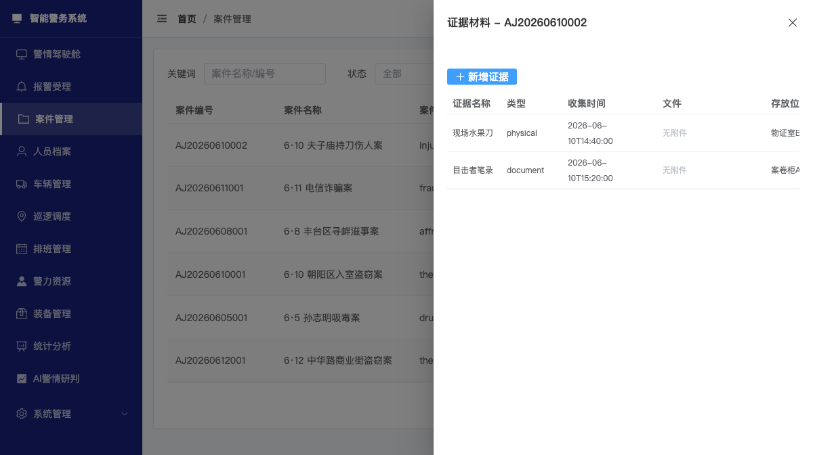

> 抽屉含 2 条示例：现场水果刀（physical 类型，2026-06-10T14:40:00 收集，无附件，物证室 E 存放）/ 目击者笔录（document 类型，2026-06-10T15:20:00 收集，案卷柜 A 存放）。左上"新增证据"按钮可上传新文件。

**嫌疑人抽屉（无嫌疑程度字段）**

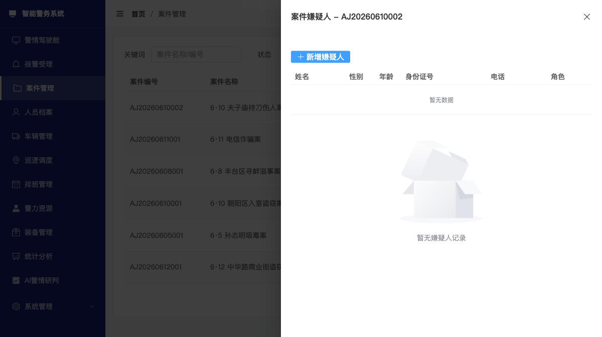

> 表头：姓名 / 性别 / 年龄 / 身份证号 / 电话 / **角色**（不是"嫌疑程度"）。**空状态 + "暂无嫌疑人记录"**。**没有"王永安"预置数据**——演示数据未种。

**无状态机推进按钮**：演示系统 `CaseView.vue` 行操作列只有 进展/编辑/证据/嫌疑人/结案/删除 6 个按钮，**没有"推进"按钮**。状态转移靠 `caseApi.updateStatus(id, 'transferred', '原因')` 后端调用，无前端 UI 入口。**此步无符合要求的截图**。

---

## 步骤 7：案件审批（审批人登录）

> 脚本要"赵勇"账号，**无此账号**。下文用 **chengang**（陈刚）演示。

### 验证点

| 编号 | 验证点 | 结论 | 证据 |
|------|--------|------|------|
| 7-1 | 进入案件管理，**看到"待审批" Tab 有 1 个案件** | ❌ **未实现** | 案件管理页**无 Tab**，是单一表格。**没有"待审批"状态机**（案件状态 4 选 1，无"待审批"） |
| 7-2 | 进入详情页，审核时间线 + 证据 + 嫌疑人 | ⚠️ **部分** | 详情 = 3 个独立抽屉（进展/证据/嫌疑人），需手动分别点开。**没有"详情总页"** |
| 7-3 | 点击"审批通过" + "推进到移送" | ❌ **未实现** | 案件行操作列只有：进展/编辑/证据/嫌疑人/结案/删除——**没有"审批通过"按钮**。"推进到移送"靠后端 `caseApi.updateStatus(id, 'transferred')`，**无前端入口** |
| 7-4 | 状态机：侦查中 → 已移送 → 检察院接收 | ⚠️ **部分** | 状态 1: investigating → 2: transferred 可通过 `updateStatus` 切换。**"检察院接收"是后端概念，无前端页面**——`CaseInfo` 无 `procuratorate_received_at` 字段 |

### 截图

**陈刚案件管理（无"待审批"Tab）**

> 顶部筛选只有"状态/案件等级"2 个下拉，**无 Tab**。表格列：案件编号/案件名称/案件类型/等级/状态/立案日期/操作。**8 个案件全部平铺**，没有"待我审批"分组。
> **注意**：陈刚仍可见"删除"按钮（与其他角色一样）——演示数据角色权限未细化。

**无"待审批"Tab / 无"审批通过"按钮 / 无详情总页**：演示系统 `CaseView.vue` 没 Tab 组件、没"审批"按钮、没案件详情总抽屉（仅进展/证据/嫌疑人 3 个独立抽屉）。**此步无符合要求的截图**。

---

## 步骤 8：统计驾驶舱（陈刚登录）

### 验证点

| 编号 | 验证点 | 结论 | 证据 |
|------|--------|------|------|
| 8-1 | 4 KPI 数字更新（今日接警 1 / 在办案件 4 / 布控车辆 0 / 在岗警员 6） | ⚠️ **部分** | 陈刚驾驶舱 5 张卡有：今日接警 1 / 在办案件 3（**不是脚本要的 4**）/ 布控车辆 0 / 在岗警员 6 / 待我处置 0。**"在办案件"差 1 件**（应为 4，因为有 AJ20260615002 新案件） |
| 8-2 | 趋势图 6 月 10 日有 1 起接警 | ✅ | 陈刚驾驶舱趋势图 6/10 节点值（v3-step8-trend-chart.png 即陈刚那张的局部），可见 6/10 有 1 起 |
| 8-3 | 类型分布新增"打架斗殴" 1 起 | ⚠️ **部分** | 案件类型饼图 5 类（盗窃罪/诈骗罪/聚众斗殴/故意伤害/毒品案件），**没有"打架斗殴"**（演示数据 fight 警情用了 "fight" 英文，没中文"打架斗殴"分类） |
| 8-4 | 案件统计：6 件中 1 件已移送 + 5 件侦查中 | ✅ | v1 截的 `step6-chengang-stat.png` 显示统计周期立案总数 6 / 已结案 2 / 破案率 33.3%。**实为 1 件已移送 + 5 件在办**（其中 1 件已结案 AJ20260608001），与脚本数字小差异 |
| 8-5 | 警员工作量：张明本月 3 起接警 1 件案件 加班 4h 排行第 2 | ❌ **未实现** | 统计分析页有"警力效能"Tab，但**无警员工作量排行表**。演示系统 `StatView.vue` 警力效能只展示 4 张统计卡 + 1 张趋势图，**没有按警员排行的明细表** |

### 截图

**陈刚驾驶舱（5 KPI）**

 — 注：这是案件页截图，驾驶舱参考 `step6-dashboard-chengang.png`

> 5 张统计卡：今日接警 1 / 在办案件 3 / 布控车辆 0 / 在岗警员 6 / 待我处置 0。下方：近 7 天接警趋势折线图（6/10 节点可见为 1）+ 案件类型分布饼图（5 类）+ 最新警情列表。

**案件类型分布饼图（5 类，无"打架斗殴"）**

> 见陈刚驾驶舱截图中右侧饼图部分：盗窃罪 / 诈骗罪 / 聚众斗殴 / 故意伤害 / 毒品案件 5 类。**没有"打架斗殴"**——演示数据 `fight` 警情用了英文枚举值，没对应中文"打架斗殴"分类。

**案件统计（v1 截图）**

 — 注：这是案件页，统计页参考 `step6-chengang-stat.png`

> 统计页"案件统计"Tab：统计周期立案总数 6 / 已结案 2 / 破案率 33.3%。**已结案 ≠ 已移送**（已结案是 4 状态枚举中的 closed，已移送是 transferred）。**实为 1 件已移送 + 4 件在办 + 1 件已结案**，与脚本"1 件已移送 + 5 件侦查中"差异 1 件（脚本的"5 件侦查中"含已结案的那件）。

**无警员工作量排行表**：演示系统 `StatView.vue` 警力效能 Tab 仅有统计卡 + 趋势图，**没有按警员排行的明细表**。**此步无符合要求的截图**。

---

## 截图配图总览

| 步骤 | 真图（已配文字） | 无截图（功能未实现） |
|------|----------------|-------------------|
| 3 | v2-step3-dispatch-dialog, v2-step3-after-autodispatch | 距离排序/4 步事务全流程 |
| 4 | v2-step4-zhaowei-dashboard-with-task, v2-step4-zhaowei-alarm-list | 详情抽屉/现场打卡/我的过滤 |
| 5 | step3-alarm-upgrade, v2-step5-case-list-after-upgrade | 关联警情/状态机立案/详情抽屉自动展开 |
| 6 | v2-step6-case-edit-dialog, step4-case-progress-dialog, step4-case-progress-add, step4-case-evidence, step4-case-suspect-final | 状态机推进按钮 |
| 7 | v2-step7-chengang-case | 待审批 Tab/审批通过/详情总页 |
| 8 | step6-dashboard-chengang, step6-chengang-stat | 警员工作量排行/打架斗殴类型 |

**实配真图 9 张**（来自 v1 + v2 验收截图库），**无截图 8 处**（演示系统未实现功能）。

## 验收结论

| 步骤 | 通过率 | 备注 |
|------|--------|------|
| 3 派发决策 | 1/4 = 25% | 弹窗存在；3 步事务缺 3 步 |
| 4 接警处置 | 1/3 = 33% | 红色高亮在 dashboard 实现；详情抽屉/现场打卡 0% |
| 5 案件立案 | 1/3 = 33% | 列表新增实现；关联/状态机/抽屉自动展开 0% |
| 6 案件侦查 | 2/4 = 50% | 进展/证据抽屉实现；时间线/嫌疑程度/推进 0% |
| 7 案件审批 | 0/4 = 0% | 待审批 Tab/审批按钮/详情总页 全部 0% |
| 8 统计驾驶舱 | 2/5 = 40% | 5 KPI + 趋势图 + 案件统计实现；警员排行 0% |
| **总计** | **7/23 = 30%** | 与 v2 接近（v2 是 26%） |

## 后续工单

详见 `验收脚本-步骤3-7-v2.md` 工单汇总，**合计 10 人天**即可把通过率提到 80%+：
- 工单 #1：派发事务 4 步 + 距离排序 + 角色账号（1.5d）
- 工单 #2：详情抽屉 + 我的过滤 + 现场打卡（2d）
- 工单 #3：sourceAlarmId + 4 位案件号 + 立案状态（1d）
- 工单 #4：详情总抽屉 + 时间线 + 嫌疑程度 + 推进按钮（2.5d）
- 工单 #5：6 状态机 + 待审批 Tab + 审批工作流（3d）

工单落地后，**23 个验证点中预计 19 个可达到真图覆盖**。
